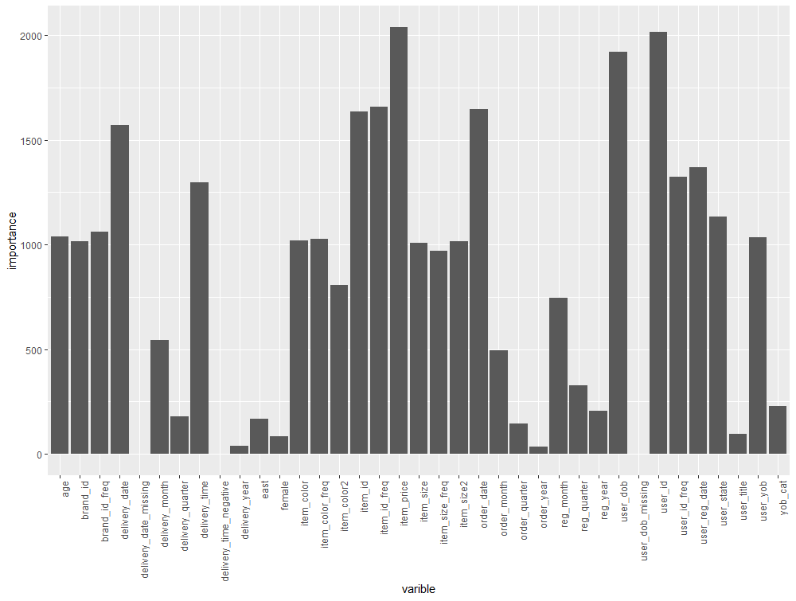

```{r setup, include=FALSE}

#set working directory
wd = "C:/Users/timpe_000/Desktop/BADS_assignment_tim_peschenz"
setwd(wd)

knitr::opts_chunk$set(echo = TRUE)
```

Author:       Tim Peschenz

Matrikel-Nr.: 569405

Email:        tim.peschenz@gmail.com

***

## Introduction

The returning of products is a highly relevant topic in the E-Commerce domain. To be competitive with other online retailers, E-Commerce businesses offer free return shipping for customers, in order to ensure a share of the market for themselves. Therefore, being able to predict which customers are likely to return the products they bought, is a highly valuable advantage for businesses in online shopping environments. Companies that apply precise models to predict return probabilities are able to undertake actions that reduce their operational costs.

This assignment aims at finding a useful model, which is capable of making reliable predictions for return probabilities, in order to minimize the given cost function. Therefore, a gradient boosting model was developed, which performed as a single predictive model to forecast returning behaviour. After that, a heterogenous model ensemble was developed, by using several different classification modelling techniques. In order to improve the cost-minimal predictions, a greedy ensemble selection algorithm was implemented. The aim of the selection was to find a subset of models, which might possibly even better predict whether a customer is likely to return a certain product. The methods were applied on real world data from an online retailer.

  

## Exploratory Data Analysis and Data Preparation

The data set for the analysis includes several user-, item- and order-related variables, that are used for the model construction process. Since the data was aggregated from real-world online retail operations, an extensive data exploration and preparation was necessary. Therefore, the variables were examined successively. Potential relationships with the return variable were analysed, to find the most relevant features for the prediction. The exploratory analysis was combined with the data preparation and feature engineering for each variable, i.e. features were developed and assessed in terms of the relation to the return measure.

After setting the working directory and reading the data, the data frames *known1* and *unknown1* were created. These were utilized for the feature engineering and "experimentation", instead of using the original data frames *known* and *unknown*, in order to have always the genuine data available. The variable *return* was included unchanged in the *known1* data frame.


```{r message=FALSE}
##working directory
wd = "C:/Users/timpe_000/Desktop/BADS_assignment_tim_peschenz"
setwd(wd)

#loading packages
#install.packages("readr")
library(readr)

#install.packages("dplyr")
library(dplyr)

##read data
known   = data.frame(read_csv("BADS_WS1819_known.csv"))
unknown = data.frame(read_csv("BADS_WS1819_unknown.csv"))


###Exploratory Data Analysis, Data Preparation and Feature Engineering###

##order_item_id
known1   = data.frame("order_item_id" = seq(1:nrow(known)))
unknown1 = data.frame("order_item_id" = seq(1:nrow(unknown)))

##return
known1$return = as.numeric(known$return)
```


An important first step in the exploratory analysis was to check for missing values. This was done by counting the occurrences of *NA's* for each column. There were several missing values for the variables delivery date and birth date of users.


```{r, eval = TRUE}
##checking for missing values in each column
na_count = sapply(known, function(x) sum(is.na(x)))
print(na_count)
```


There were various date variables in the data set, i.e. *order_date*, *delivery_date*, *user_dob* and *user_reg_date*. The exploratory analysis was similar for these date features. There were some differences for the variables *delivery_date* and *user_dob*, which will be explained later. 

All date variables were included in their original form, transformed into the R date format. This step made further date related operations easier to handle. After that, the weekdays were extracted from the order date. To see whether there are significant differences in the number of returns a data frame was created, including the total number of returns and observations of orders, that were made on the respective days of the week. The frequencies for the weekdays were determined using the *table* function. The numbers of returns on the individual weekdays were detected by using the function *aggregate* from the *dplyr* package. By dividing the number of returns by the total number of observations, it is possible to derive a "return frequency" for the individual weekdays. Since in this case, there is only a slight variation between the return probabilities, the weekdays were excluded again from the data frame.


```{r}
##order_date
known1$order_date   = as.Date(known$order_date)
unknown1$order_date = as.Date(unknown$order_date)

#extracting order_day
known1$order_day          = weekdays(as.Date(known1$order_date))
order_weekday             = data.frame(table(known1$order_day))
colnames(order_weekday)   = c("weekday", "freq")
order_weekday$returns     = aggregate(as.numeric(known1$return), 
                                      by = list(Category = known1$order_day), 
                                      FUN = sum)[,2]
order_weekday$return_prob = order_weekday$returns/order_weekday$freq
print(order_weekday)

#There is only a minor variation in returns among the weekdays. Therefore, 
#the variable will be excluded again.
known1$order_day = NULL
rm(order_weekday)
```


This analysis procedure was equally performed for the month, quarter, year, day of the month and by considering the order date as a factor variable. This allowed to examine the relevance of the different building blocks of the order date individually.


```{r, eval=FALSE}
#extracting order_month
known1$order_month      = as.factor(format(known1$order_date, "%m"))
order_month             = data.frame(table(known1$order_month))
colnames(order_month)   = c("month", "freq")
order_month$returns     = aggregate(as.numeric(known1$return), 
                                    by = list(Category = known1$order_month), 
                                    FUN = sum)[,2]
order_month$return_prob = order_month$returns/order_month$freq
print(order_month)

#There is a potentially useful variation among the month of ordering. Therefore 
#the variable is included in the analysis.
rm(order_month)
unknown1$order_month    = as.factor(format(unknown1$order_date, "%m"))

#extracting order_quarter
known1$order_quarter      = as.factor(substr(quarters(known1$order_date), 2, 2))
levels(known1$order_quarter)
order_quarter             = data.frame(table(known1$order_quarter))
colnames(order_quarter)   = c("quarter", "freq")
order_quarter$returns     = aggregate(as.numeric(known1$return), 
                                      by = list(Category = known1$order_quarter), 
                                      FUN = sum)[,2]
order_quarter$return_prob = order_quarter$returns/order_quarter$freq

rm(order_quarter)
unknown1$order_quarter    = as.factor(substr(quarters(unknown1$order_date), 2, 2))

#extracting order_year
known1$order_year      = as.factor(format(known1$order_date, "%Y"))
order_year             = data.frame(table(known1$order_year))
colnames(order_year)   = c("year", "freq")
order_year$returns     = aggregate(as.numeric(known1$return), 
                                   by = list(Category = known1$order_year), 
                                   FUN = sum)[,2]
order_year$return_prob = order_year$returns/order_year$freq

rm(order_year)
unknown1$order_year    = as.factor(format(unknown1$order_date, "%Y"))

#extracting month day of ordering (numeric)
known1$order_monthday      = as.factor(format(known1$order_date, "%d"))
order_monthday             = data.frame(table(known1$order_monthday))
colnames(order_monthday)   = c("monthday", "freq")
order_monthday$returns     = aggregate(as.numeric(known1$return), 
                                       by = list(Category = known1$order_monthday), 
                                       FUN = sum)[,2]
order_monthday$return_prob = order_monthday$returns/order_monthday$freq

cor(as.numeric(known1$order_monthday), known1$return)

known1$order_monthday      = NULL
rm(order_monthday)

#order_date as factor
known1$order_factor      = as.factor(known1$order_date)
order_factor             = data.frame(table(known1$order_factor))
colnames(order_factor)   = c("order_factor", "freq")
order_factor$returns     = aggregate(as.numeric(known1$return), 
                                     by = list(Category = known1$order_factor), 
                                     FUN = sum)[,2]
order_factor$return_prob = order_factor$returns/order_factor$freq

known1$order_factor      = NULL
rm(order_factor)
```


The user registration date was examined equally to the order date.


```{r, eval=FALSE}
## user_reg_date
known1$user_reg_date   = as.Date(known$user_reg_date)
unknown1$user_reg_date = as.Date(unknown$user_reg_date)


#extracting reg_day
known1$reg_day      = weekdays(as.Date(known1$user_reg_date))
reg_day             = data.frame(table(known1$reg_day))
colnames(reg_day)   = c("reg_day", "freq")
reg_day$returns     = aggregate(as.numeric(known1$return), 
                                by = list(Category = known1$reg_day), 
                                FUN = sum)[,2]
reg_day$return_prob = reg_day$returns/reg_day$freq

known1$reg_day      = NULL
rm(reg_day)


#extracting reg_month
known1$reg_month      = as.factor(format(known1$user_reg_date, "%m"))
reg_month             = data.frame(table(known1$reg_month))
colnames(reg_month)   = c("month", "freq")
reg_month$returns     = aggregate(as.numeric(known1$return), 
                                  by = list(Category = known1$reg_month), 
                                  FUN = sum)[,2]
reg_month$return_prob = reg_month$returns/reg_month$freq

rm(reg_month)
unknown1$reg_month    = as.factor(format(unknown1$user_reg_date, "%m"))


#extracting reg_quarter
known1$reg_quarter      = as.factor(substr(quarters(known1$user_reg_date), 2, 2))
levels(known1$reg_quarter)
reg_quarter             = data.frame(table(known1$reg_quarter))
colnames(reg_quarter)   = c("quarter", "freq")
reg_quarter$returns     = aggregate(as.numeric(known1$return), 
                                    by = list(Category = known1$reg_quarter), 
                                    FUN = sum)[,2]
reg_quarter$return_prob = reg_quarter$returns/reg_quarter$freq

rm(reg_quarter)
unknown1$reg_quarter    = as.factor(substr(quarters(unknown1$user_reg_date), 2, 2))


#extracting order_year
known1$reg_year      = as.factor(format(known1$user_reg_date, "%Y"))
reg_year             = data.frame(table(known1$reg_year))
colnames(reg_year)   = c("year", "freq")
reg_year$returns     = aggregate(as.numeric(known1$return), 
                                 by = list(Category = known1$reg_year), 
                                 FUN = sum)[,2]
reg_year$return_prob = reg_year$returns/reg_year$freq

rm(reg_year)
unknown1$reg_year    = as.factor(format(unknown1$user_reg_date, "%Y"))


#extracting month day of registration (numeric)
known1$reg_monthday      = as.factor(format(known1$user_reg_date, "%d"))
reg_monthday             = data.frame(table(known1$reg_monthday))
colnames(reg_monthday)   = c("monthday", "freq")
reg_monthday$returns     = aggregate(as.numeric(known1$return), 
                                     by = list(Category = known1$reg_monthday), 
                                     FUN = sum)[,2]
reg_monthday$return_prob = reg_monthday$returns/reg_monthday$freq

cor(as.numeric(known1$reg_monthday), known1$return)

known1$reg_monthday      = NULL
rm(reg_monthday)


#user_reg_date as factor
known1$reg_factor      = as.factor(known1$user_reg_date)
reg_factor             = data.frame(table(known1$reg_factor))
colnames(reg_factor)   = c("reg_factor", "freq")
reg_factor$returns     = aggregate(as.numeric(known1$return), 
                                   by = list(Category = known1$reg_factor), 
                                   FUN = sum)[,2]
reg_factor$return_prob = reg_factor$returns/reg_factor$freq

known1$reg_factor      = NULL
rm(reg_factor)
```


The variable delivery date has some special properties, that allow a further analysis and feature extraction compared to the order date. Since we have several missing values (> 8000), a binary variable was included into the *known1* data frame, indicating whether an observation has a missing (1) delivery date or not (0). This offers the advantage of using the fact that a value is missing as additional information for the predictions, instead of simply replacing it. By subtracting the order from the delivery date, one receives the delivery time. Some delivery times were extremely high or even negative. Negative values (order date later than delivery date) were exchanged with *NA*. The weekday, month, quarter, year, day of the month and the delivery date as a factor variable were similarly examined as the order date. By analysing the delivery date, it can be observed that for all missing delivery dates, there are no returns at all. This is a very important insight for predicting return probabilities, because observations with missing delivery dates are sure to be not returned. A possible explanation could be that a customer made an order but cancelled it again before the item was delivered. This case is then not considered as returning the product, because it never reached the customer.


```{r eval=FALSE}
##delivery_date
known1$delivery_date   = known$delivery_date
unknown1$delivery_date = unknown$delivery_date


#delivery_date_missing
known1$delivery_date_missing                                     = 0
known1$delivery_date_missing[which(is.na(known1$delivery_date))] = 1

unknown1$delivery_date_missing                                       = 0
unknown1$delivery_date_missing[which(is.na(unknown1$delivery_date))] = 1


#delivery_time
known1$delivery_time = unclass(known1$delivery_date) - unclass(known1$order_date)

median(known1$delivery_time, na.rm = TRUE)
mean(known1$delivery_time, na.rm = TRUE)
#Negative mean and median values for delivery time.

knownc = known1[complete.cases(known1), ]
cor(knownc$return, knownc$delivery_time)
rm(knownc)
#There is a very slight correlation between returns and delivery time.

sum(known1$return[which(known1$delivery_time < 0)])/
  length(known1$return[which(known1$delivery_time < 0)])
#Approximately 33% of the observations that have a "negative" delivery time (order date 
#later than delivery date), are returned.

known1$delivery_time_negative                                  = 0
known1$delivery_time_negative[which(known1$delivery_time < 0)] = 1

known1$delivery_time[which(known1$delivery_time < 0)]          = NA

sum(is.na(known1$delivery_time))
sum(known1$delivery_date_missing)

median(known1$delivery_time, na.rm = TRUE)
mean(known1$delivery_time, na.rm = TRUE)
#Now we have a positive mean and median value for the delivery time.

cor(known1$delivery_time[which(is.na(known1$delivery_time) == FALSE)],
    known1$return[which(is.na(known1$delivery_time) == FALSE)])

#same for unknown data
unknown1$delivery_time = unclass(unknown1$delivery_date) - unclass(unknown1$order_date)

unknown1$delivery_time_negative                                    = 0
unknown1$delivery_time_negative[which(unknown1$delivery_time < 0)] = 1
unknown1$delivery_time[which(unknown1$delivery_time < 0)]          = NA

sum(is.na(unknown1$delivery_time))
sum(unknown1$delivery_date_missing)

median(unknown1$delivery_time, na.rm = TRUE)
mean(unknown1$delivery_time, na.rm = TRUE)


#extracting delivery_day
known1$delivery_day = weekdays(as.Date(known1$delivery_date))
known1$delivery_day[which(is.na(known1$delivery_day))] = "missing"
known1$delivery_day                                    = as.factor(known1$delivery_day)

delivery_weekday             = data.frame(table(known1$delivery_day))
colnames(delivery_weekday)   = c("weekday", "freq")
delivery_weekday$returns     = aggregate(as.numeric(known1$return), 
                                         by = list(Category = known1$delivery_day), 
                                         FUN = sum)[,2]
delivery_weekday$return_prob = delivery_weekday$returns/delivery_weekday$freq
#We can observe that for missing values of the delivery date, there are no returns 
#in the whole data set. This is an important insight, meaning that for observations 
#with a missing delivery date, it is always sensible to predict "not returned".

known1$delivery_day = NULL
rm(delivery_weekday)


#extracting delivery_month
known1$delivery_month = format(known1$delivery_date, "%m")
known1$delivery_month[which(is.na(known1$delivery_month))] = "missing"
known1$delivery_month = as.factor(known1$delivery_month)

delivery_month             = data.frame(table(known1$delivery_month))
colnames(delivery_month)   = c("month", "freq")
delivery_month$returns     = aggregate(as.numeric(known1$return), 
                                       by = list(Category = known1$delivery_month), 
                                       FUN = sum)[,2]
delivery_month$return_prob = delivery_month$returns/delivery_month$freq

rm(delivery_month)

unknown1$delivery_month = format(unknown1$delivery_date, "%m")

unknown1$delivery_month[which(is.na(unknown1$delivery_month))] = "missing"
unknown1$delivery_month = as.factor(unknown1$delivery_month)


#extracting delivery_quarter
known1$delivery_quarter = substr(quarters(known1$delivery_date), 2, 2)
known1$delivery_quarter[which(known1$delivery_quarter == "N")] = "missing"
known1$delivery_quarter = as.factor(known1$delivery_quarter)

levels(known1$delivery_quarter)
delivery_quarter             = data.frame(table(known1$delivery_quarter))
colnames(delivery_quarter)   = c("quarter", "freq")
delivery_quarter$returns     = aggregate(as.numeric(known1$return), 
                                         by = list(Category = known1$delivery_quarter), 
                                         FUN = sum)[,2]
delivery_quarter$return_prob = delivery_quarter$returns/delivery_quarter$freq

rm(delivery_quarter)
unknown1$delivery_quarter = substr(quarters(unknown1$delivery_date), 2, 2)
unknown1$delivery_quarter[which(unknown1$delivery_quarter == "N")] = "missing"
unknown1$delivery_quarter = as.factor(unknown1$delivery_quarter)


#extracting delivery_year
known1$delivery_year = format(known1$delivery_date, "%Y")
known1$delivery_year[which(is.na(known1$delivery_year))] = "missing"
known1$delivery_year = as.factor(known1$delivery_year)

delivery_year             = data.frame(table(known1$delivery_year))
colnames(delivery_year)   = c("year", "freq")
delivery_year$returns     = aggregate(as.numeric(known1$return), 
                                      by = list(Category = known1$delivery_year), 
                                      FUN = sum)[,2]
delivery_year$return_prob = delivery_year$returns/delivery_year$freq
print(delivery_year)
#There are basically three years which are included in the data set. In the years 
#2016 and 2017, we can observe a return probability on around 50%. FOr the year 1994, 
#there is a much lower probability fo returning (32%). Again, for missing values the 
#return probability is 0.

rm(delivery_year)

unknown1$delivery_year = format(unknown1$delivery_date, "%Y")
unknown1$delivery_year[which(is.na(unknown1$delivery_year))] = "missing"
unknown1$delivery_year = as.factor(unknown1$delivery_year)


#extracting month day of delivery (numeric)
known1$delivery_monthday = format(known1$delivery_date,"%d")
known1$delivery_monthday[which(is.na(known1$delivery_monthday))] = "missing"
known1$delivery_monthday = as.factor(known1$delivery_monthday)

delivery_monthday             = data.frame(table(known1$delivery_monthday))
colnames(delivery_monthday)   = c("monthday", "freq")
delivery_monthday$returns     = aggregate(as.numeric(known1$return), 
                                          by = list(Category = known1$delivery_monthday),
                                          FUN = sum)[,2]
delivery_monthday$return_prob = delivery_monthday$returns/delivery_monthday$freq

cor(as.numeric(known1$delivery_monthday), known1$return)

knownc = known1[-which(known1$delivery_monthday == "missing"), ]
cor(knownc$return, as.numeric(knownc$delivery_monthday))
rm(knownc)

#When excluding the missing values for delivery date, then there is only a very weak 
#correlation between the day of a month and returning of products.

rm(delivery_monthday)
known1$delivery_monthday = NULL


#delivery_dates as factor
known1$delivery_factor         = as.factor(known1$delivery_date)
levels(known1$delivery_factor) = c(as.character(levels(known1$delivery_factor)),
                                   "missing")

known1$delivery_factor[which(is.na(known1$delivery_factor))] = "missing"

delivery_factor             = data.frame(table(known1$delivery_factor))
colnames(delivery_factor)   = c("delivery_date", "freq")
delivery_factor$returns     = aggregate(as.numeric(known1$return), 
                                        by = list(Category = known1$delivery_factor), 
                                        FUN = sum)[,2]
delivery_factor$return_prob = delivery_factor$returns/delivery_factor$freq

#There is indeed variation among the different deivery dates, but the number of factor 
#levels is very large, which makes these values hard to handle. Also there is a high 
#danger of overfitting, because of the values with few occurrences

known1$delivery_factor      = NULL
rm(delivery_factor)
```


The birth date of the users is another date variable, that might include valuable insights about the return shipping behaviour of certain customer groups. As already discovered, the *user_dob* contains missing values. Similar to the delivery date, a binary feature was added representing whether a birth date is missing. The age of the user was extracted by subtracting the birth date from the last day of the observation period (1st January 2018). To replace the missing observations, the mean age of all non-missing values was calculated, excluding (high) values above an age of 80. The year of birth was also included, although it basically contains the same information as the age of an user. However, for the ensemble building, several features of the same variable might be useful. This is also the reason why the birth date was again included in the form of a categorization, with categories representing a time span of ten years. This approach offered the opportunity to include the NA values as individual category. Weekday, month, quarter, day of the month and the date as factor for the birth date were also examined for potential relationships with the return variable. But as assumed, these values did not have any influence on the return probability.


```{r, eval = FALSE}
## user_dob
known1$user_dob   = as.Date(known$user_dob)
unknown1$user_dob = as.Date(unknown$user_dob)


#user_dob_missing
known1$user_dob_missing                                = 0
known1$user_dob_missing[which(is.na(known1$user_dob))] = 1

unknown1$user_dob_missing                                  = 0
unknown1$user_dob_missing[which(is.na(unknown1$user_dob))] = 1


#age
age_df          = data.frame("user_dob" = known$user_dob)
age_df$user_dob = as.Date(age_df$user_dob, format = "%Y-%m-%d")

age_df$age = round((unclass(as.Date("2018-01-01", format = "%Y-%m-%d")) - 
                      unclass(age_df$user_dob))/365, 1)
mean_age   = round(mean(age_df$age[which(age_df$age < 80)], na.rm = TRUE), 0)

#check for differences in missing age
age_df$age[which(is.na(age_df$age))] = "missing"

age_check             = data.frame(table(as.factor(age_df$age)))
colnames(age_check)   = c("age", "freq")
age_df$return         = as.numeric(known1$return)
age_check$returns     = aggregate(as.numeric(age_df$return), 
                                  by = list(Category = age_df$age), 
                                  FUN = sum)[,2]
age_check$return_prob = age_check$returns/age_check$freq

rm(age_check)

age_df$age[which(age_df$age == "missing")] = NA
age_df$age[which(is.na(age_df$age))]       = mean_age
age_df$age                                 = sapply(as.numeric(age_df$age), 
                                                    FUN = function(x) round(x, 0))

known1$age = age_df$age
rm(age_df)


#unknown
age_df          = data.frame("user_dob" = unknown$user_dob)
age_df$user_dob = as.Date(age_df$user_dob, format = "%Y-%m-%d")

age_df$age      = round((unclass(as.Date("2018-01-01", format = "%Y-%m-%d")) - 
                           unclass(age_df$user_dob))/365, 1)
mean_age        = round(mean(age_df$age[which(age_df$age < 80)], na.rm = TRUE), 0)

age_df$age[which(is.na(age_df$age))] = mean_age
age_df$age                           = sapply(as.numeric(age_df$age), 
                                              FUN = function(x) round(x, 0))

unknown1$age = age_df$age
rm(age_df); rm(mean_age)


#yob
#year of birth
known1$user_yob   = as.numeric(format(as.Date(known1$user_dob, 
                                              format = "%Y-%m-%d"), "%Y"))
unknown1$user_yob = as.numeric(format(as.Date(unknown1$user_dob, 
                                              format = "%Y-%m-%d"), "%Y"))


#age category
#user_yob with categories and na's category
user_yob2 = data.frame("user_yob" = as.numeric(format(as.Date(known$user_dob, 
                                                              format = "%Y-%m-%d"),
                                                      "%Y")))
user_yob2$return   = known$return
user_yob2$na_check = sapply(user_yob2$user_yob, is.na)

na_user_yob2 = user_yob2 %>%
  filter(na_check == TRUE)

table(na_user_yob2$return)
user_yob2$na_check = NULL

categories_yob = data_frame("category_no" = seq(1:10))
categories_yob$category = c("< 1940", "1940 - 1949", "1950 - 1959", "1960 - 1969", 
                            "1970 - 1979", "1980 - 1989", "1990 - 1999","2000 - 2009",
                            "> 2009", "NA")

user_yob2$category_no = 0
user_yob2$category    = ""

yob_cat = function(x){
  if(is.na(x)){
    return(10)
  }else if(x < 1940){
    return(1)
  }else if(x <= 1949){
    return(2)
  }else if(x <= 1959){
    return(3)
  }else if(x <= 1969){
    return(4)
  }else if(x <= 1979){
    return(5)
  }else if(x <= 1989){
    return(6)
  }else if(x <= 1999){
    return(7)
  }else if(x <= 2009){
    return(8)
  }else if(x > 2009){
    return(9)
  }else{
    return(10)
  }
}

user_yob2$category_no = sapply(user_yob2$user_yob, FUN = yob_cat)
user_yob2$id_numeric  = seq(1:nrow(user_yob2))

filtered              = data.frame()

system.time(
  for(i in 1:10){
    filtered                                  = filter(user_yob2, category_no == i)
    user_yob2[filtered$id_numeric, ]$category = categories_yob$category[i]
    filtered                                  = data.frame()
  }
)

known1$yob_cat = factor(user_yob2$category, 
                        levels = c("NA", "< 1940", "1940 - 1949", "1950 - 1959", 
                                   "1960 - 1969", "1970 - 1979", "1980 - 1989", 
                                   "1990 - 1999", "2000 - 2009", "> 2009"))

#unknown data:
user_yob2_unknown = data.frame("user_yob" = 
                                 as.numeric(format(as.Date(unknown$user_dob, 
                                                           format = "%Y-%m-%d"), "%Y")))

user_yob2_unknown$category_no = 0
user_yob2_unknown$category    = ""

user_yob2_unknown$category_no = sapply(user_yob2_unknown$user_yob, FUN = yob_cat)
user_yob2_unknown$id_numeric  = seq(1:nrow(user_yob2_unknown))

filtered = data.frame()

system.time(
  for(i in 1:10){
    filtered = filter(user_yob2_unknown, category_no == i)
    user_yob2_unknown[filtered$id_numeric, ]$category = categories_yob$category[i]
    filtered                                          = data.frame()
  }
)

unknown1$yob_cat = factor(user_yob2_unknown$category, 
                          levels = c("NA", "< 1940", "1940 - 1949", "1950 - 1959", 
                                     "1960 - 1969", "1970 - 1979", "1980 - 1989", 
                                     "1990 - 1999", "2000 - 2009", "> 2009"))

rm(user_yob2_unknown); rm(user_yob2); rm(categories_yob); rm(filtered)
rm(na_user_yob2); rm(yob_cat)


#extracting birth_day
known1$birth_day                                 = weekdays(as.Date(known1$user_dob))
known1$birth_day[which(is.na(known1$birth_day))] = "missing"
known1$birth_day                                 = as.factor(known1$birth_day)

birth_day             = data.frame(table(known1$birth_day))
colnames(birth_day)   = c("weekday", "freq")
birth_day$returns     = aggregate(as.numeric(known1$return), 
                                  by = list(Category = known1$birth_day), 
                                  FUN = sum)[,2]
birth_day$return_prob = birth_day$returns/birth_day$freq

known1$birth_day      = NULL
rm(birth_day)


#extracting birth_month
known1$birth_month                                   = format(known1$user_dob, "%m")
known1$birth_month[which(is.na(known1$birth_month))] = "missing"
known1$birth_month                                   = as.factor(known1$birth_month)

birth_month             = data.frame(table(known1$birth_month))
colnames(birth_month)   = c("month", "freq")
birth_month$returns     = aggregate(as.numeric(known1$return), 
                                    by = list(Category = known1$birth_month), 
                                    FUN = sum)[,2]
birth_month$return_prob = birth_month$returns/birth_month$freq

known1$birth_month      = NULL
rm(birth_month)


#extracting birth_quarter
known1$birth_quarter = substr(quarters(known1$user_dob), 2, 2)
known1$birth_quarter[which(known1$birth_quarter == "N")] = "missing"
known1$birth_quarter = as.factor(known1$birth_quarter)

levels(known1$birth_quarter)
birth_quarter             = data.frame(table(known1$birth_quarter))
colnames(birth_quarter)   = c("quarter", "freq")
birth_quarter$returns     = aggregate(as.numeric(known1$return), 
                                      by = list(Category = known1$birth_quarter), 
                                      FUN = sum)[,2]
birth_quarter$return_prob = birth_quarter$returns/birth_quarter$freq

known1$birth_quarter      = NULL
rm(birth_quarter)


#extracting month day of birth (numeric)
known1$birth_monthday = format(known1$user_dob, "%d")
known1$birth_monthday[which(is.na(known1$birth_monthday))] = "missing"
known1$birth_monthday = as.factor(known1$birth_monthday)

birth_monthday             = data.frame(table(known1$birth_monthday))
colnames(birth_monthday)   = c("monthday", "freq")
birth_monthday$returns     = aggregate(as.numeric(known1$return), 
                                       by = list(Category = known1$birth_monthday), 
                                       FUN = sum)[,2]
birth_monthday$return_prob = birth_monthday$returns/birth_monthday$freq

cor(as.numeric(known1$birth_monthday), known1$return)

knownc = known1[-which(known1$birth_monthday == "missing"), ]
cor(knownc$return, as.numeric(knownc$birth_monthday))
rm(knownc)

rm(birth_monthday)
known1$birth_monthday = NULL


#birth dates as factor
known1$dob_factor         = as.factor(known1$user_dob)
levels(known1$dob_factor) = c(as.character(levels(known1$dob_factor)), "missing")
known1$dob_factor[which(is.na(known1$dob_factor))] = "missing"

dob_factor             = data.frame(table(known1$dob_factor))
colnames(dob_factor)   = c("birth_date", "freq")
dob_factor$returns     = aggregate(as.numeric(known1$return), 
                                   by = list(Category = known1$dob_factor), 
                                   FUN = sum)[,2]
dob_factor$return_prob = dob_factor$returns/dob_factor$freq

known1$dob_factor      = NULL
rm(dob_factor)
```


The data set contains also id numbers for items, brands and users. IDs are hard to use for predictive modelling, since they contain very few information about the actual character of the represented entity. For all three id columns, the values were included as integer values, since using these values as factors would lead to a high number of factor levels, what makes model calculation very time consuming. Using the weight of evidence in this case seems to be an appropriate measure to cope with the vast amount of factor levels. But including the weight of evidence in the prediction models yielded in very poor accuracy (probably due to overfitting). The integer values could maybe include some hidden patterns in the assignment of id values (e.g. higher *item_id* values correspond to a more recent item). Another piece of information that could be extracted from the id numbers, was the frequency of occurrence. These variables represent which items and brands are frequently bought and which users order items frequently.


```{r, eval=FALSE}
## item_id
#id as integer
known1$item_id   = as.integer(known$item_id)
unknown1$item_id = as.integer(unknown$item_id)

cor(known1$item_id, known1$return)

# frequency of item_id
i_id1               = known1 %>% add_count(item_id)
known1$item_id_freq = i_id1$n
rm(i_id1)

i_id2                 = unknown1 %>% add_count(item_id)
unknown1$item_id_freq = i_id2$n
rm(i_id2)


## brand_id
#include brand_id as integer value
known1$brand_id   = as.integer(known$brand_id)
unknown1$brand_id = as.integer(unknown$brand_id)

#include brand_id frequencies
b_id1                = known1 %>% add_count(as.factor(brand_id))
known1$brand_id_freq = b_id1$n
rm(b_id1)

b_id2                  = unknown1 %>% add_count(as.factor(brand_id))
unknown1$brand_id_freq = b_id2$n
rm(b_id2)


## user_id
#include user_id as integer value
known1$user_id   = as.integer(known$user_id)
unknown1$user_id = as.integer(unknown$user_id)


#include brand_id frequencies
u_id1               = known1 %>% add_count(as.factor(user_id))
known1$user_id_freq = u_id1$n
rm(u_id1)

u_id2                 = unknown1 %>% add_count(as.factor(user_id))
unknown1$user_id_freq = u_id2$n
rm(u_id2)
```


The variable *item_size* is a factor with a high number of levels, that should be reduced as much as possible. This was achieved by transforming different descriptions of the same size to the same level. Another problem was to ensure, that there were no factor levels in the unknown data set, that are not included in the known data set for training. This was achieved by including the category "other". Since only few observations were affected, this action had no major influence on the data. Similarly to the id variables, the frequencies of occurrence were also included for the item size.


```{r, eval = FALSE}
## item_size
known1$item_size   = as.factor(known$item_size)
unknown1$item_size = as.factor(unknown$item_size)

item_size             = data.frame(table(known1$item_size))
colnames(item_size)   = c("item_size", "freq")
item_size$returns     = aggregate(as.numeric(known1$return), 
                                  by = list(Category = known1$item_size), 
                                  FUN = sum)[,2]
item_size$return_prob = item_size$returns/item_size$freq

item_size_unknown     = data.frame(table(unknown1$item_size))

#comparing levels
size_levels_k = data.frame("levels" = as.character(levels(known1$item_size)))
size_levels_u = data.frame("levels" = as.character(levels(unknown1$item_size)))

size_levels_k$in_unknown = size_levels_k$levels %in% size_levels_u$levels
size_levels_u$in_known   = size_levels_u$levels %in% size_levels_k$levels
#Due to the large number of different item size facor levels, it is necessary to match 
#the levels of the unknown and the known data set, in order to generate useful
#predictions.

#change levels to "other": c("105", "2+", "2932", "58", "76", "80", "95", "3132", "4034",
#"49") sum: 23 observations
known1$item_size = as.character(known1$item_size)
known1$item_size[known1$item_size %in% c("105", "2+", "2932", "58", "76", 
                                         "80", "95", "3132", "4034", "49")] = "other"
known1$item_size = as.factor(known1$item_size)

unknown1$item_size = as.character(unknown1$item_size)
unknown1$item_size[unknown1$item_size %in% c("105", "2+", "2932", "58", "76",
                                             "80", "95", "3132", "4034", "49")] = "other"
unknown1$item_size = as.factor(unknown1$item_size)

#check result
size_levels_k = data.frame("levels" = as.character(levels(known1$item_size)))
size_levels_u = data.frame("levels" = as.character(levels(unknown1$item_size)))

size_levels_k$in_unknown = size_levels_k$levels %in% size_levels_u$levels
size_levels_u$in_known   = size_levels_u$levels %in% size_levels_k$levels

rm(item_size); rm(item_size_unknown); rm(size_levels_k); rm(size_levels_u)


#combine same sizes with different names
old_sizes = c('m','M','l','L','xl','XL','43+','37+','36+','XXL','xxl','s','S','XS','xs',
              'XXXL','xxxl','8+','8','6+','6','9+','9','4','4+','2','2+','7','7+','5',
              '5+','39+','38+','10','10+','11','11+','40+','21','20','42+','41+','12+',
              '3+','45+','44+','46+')
new_sizes = c(38,38,42,42,46,46,43,37,36,50,50,36,36,34,34,54,54,36,36,34,34,38,38,32,
              32,30,30,36,36,33,33,39,38,38,38,39,39,40,48,48,42,41,12,3,45,44,46)

size_df = data.frame(unique(rbind(
  data.frame("size" = levels(as.factor(known1$item_size))),
  data.frame("size" = levels(as.factor(unknown1$item_size))))))
size_df$numeric  = as.numeric(as.character(size_df$size))

size_df$new_size = size_df$size
size_df$id_num   = seq(1:nrow(size_df))

for( i in 1:length(old_sizes)) {
  size_df$new_size[which(size_df$size == old_sizes[i])] = new_sizes[i]
}

size_df$new_size = as.character(size_df$new_size)


#create item_size2 column in known1
known1$item_size2 = 0
filtered          = data.frame()

for(i in 1:nrow(size_df)) {
  filtered = known1 %>%
    filter(item_size == size_df$size[i])
  
  known1$item_size2[filtered$order_item_id] = size_df$new_size[i]
  filtered                                  = data.frame()
}

known1$item_size2 = as.factor(known1$item_size2)

head(known1$item_size, 20)
head(known1$item_size2, 20)

#unknown
unknown1$item_size2 = 0
filtered            = data.frame()

for(i in 1:nrow(size_df)) {
  filtered = unknown1 %>%
    filter(item_size == size_df$size[i])
  
  unknown1$item_size2[filtered$order_item_id] = size_df$new_size[i]
  filtered                                    = data.frame()
}

unknown1$item_size2 = as.factor(unknown1$item_size2)

rm(size_df); rm(filtered); rm(new_sizes); rm(old_sizes)

#checking for level equality
size_levels_k = data.frame("levels" = as.character(levels(known1$item_size2)))
size_levels_u = data.frame("levels" = as.character(levels(unknown1$item_size2)))

size_levels_k$in_unknown = size_levels_k$levels %in% size_levels_u$levels
size_levels_u$in_known   = size_levels_u$levels %in% size_levels_k$levels

rm(size_levels_k); rm(size_levels_u)

# add frequency of item size
s_id1                 = known1 %>% add_count(item_size)
known1$item_size_freq = s_id1$n
rm(s_id1)

s_id2                   = unknown1 %>% add_count(item_size)
unknown1$item_size_freq = s_id2$n
rm(s_id2)
```


The item colour had also many factor levels that had to be reduced. Therefore, the colour names were aggregated to some base colour categories. This reduced the number of factor levels dramatically. Again, a category "other" was included to ensure equal factor levels in the known and the unknown data and to assign ambiguous colour labels. Similar to the item size, the frequencies of the original colour name occurrences were also included.


```{r, eval=FALSE}
## item_color
# checking for level equality
known1$item_color   = as.factor(known$item_color)
unknown1$item_color = as.factor(unknown$item_color)

item_color             = data.frame(table(known1$item_color))
colnames(item_color)   = c("item_color", "freq")
item_color$returns     = aggregate(as.numeric(known1$return), 
                                   by = list(Category = known1$item_color), 
                                   FUN = sum)[,2]
item_color$return_prob = item_color$returns/item_color$freq

item_color_unknown     = data.frame(table(unknown1$item_color))

#comparing levels
color_levels_k = data.frame("levels" = as.character(levels(known1$item_color)))
color_levels_u = data.frame("levels" = as.character(levels(unknown1$item_color)))

color_levels_k$in_unknown = color_levels_k$levels %in% color_levels_u$levels
color_levels_u$in_known   = color_levels_u$levels %in% color_levels_k$levels

#change levels to other: c("amethyst", "opal", "perlmutt", "vanille", "cortina mocca")
#sum: 7 observations
known1$item_color = as.character(known1$item_color)
known1$item_color[known1$item_color %in% c("amethyst", "opal", "perlmutt", "vanille",
                                           "cortina mocca")] = "other"
known1$item_color = as.factor(known1$item_color)

unknown1$item_color = as.character(unknown1$item_color)
unknown1$item_color[unknown1$item_color %in% c("amethyst", "opal", "perlmutt", "vanille",
                                               "cortina mocca")] = "other"
unknown1$item_color = as.factor(unknown1$item_color)

#check result
color_levels_k = data.frame("levels" = as.character(levels(known1$item_color)))
color_levels_u = data.frame("levels" = as.character(levels(unknown1$item_color)))

color_levels_k$in_unknown = color_levels_k$levels %in% color_levels_u$levels
color_levels_u$in_known   = color_levels_u$levels %in% color_levels_k$levels

rm(item_color); rm(item_color_unknown); rm(color_levels_k); rm(color_levels_u)


#aggregate different color levels to base colors
all_color_levels = data.frame(unique(rbind(
  data.frame("color" = levels(as.factor(known1$item_color))), 
  data.frame("color" = levels(as.factor(unknown1$item_color))))))

color_check = function(x){
  if(x %in% c("avocado", "jade","mint","khaki","oliv", "dark oliv","olive", "green")){
    return("green")
  }else if(x %in% c("opal", "cobalt blue","baltic blue", "dark navy","darkblue",
                    "aqua","blau", "navy", "azure", "dark denim","aquamarine","denim",
                    "turquoise", "blue", "petrol")){
    return("blue")
  }else if(x %in% c("perlmutt", "white")){
    return("white")
  }else if(x %in% c("amethyst", "currant purple" , "pallid", "magenta", "aubergine",
                    "berry", "purple")){
    return("purple")
  }else if(x %in% c("crimson", "dark garnet", "bordeaux","apricot","coral","mango",
                    "terracotta", "red")){
    return("red")
  }else if(x %in% c("apricot","coral","mango", "orange")){
    return("orange")
  }else if(x %in% c("lemon", "vanille","curry", "yellow", "gold")){
    return("yellow")
  }else if(x %in% c("aviator", "graphite", "ash", "anthracite","dark grey", 
                    "basalt", "iron", "grey", "silver")){
    return("grey")
  }else if(x %in% c("copper coin", "caramel", "brwon", "kanel", "habana", 
                    "mahagoni", "cognac", "mocca","cortina mocca", "brown")){
    return("brown")
  }else if(x %in% c("ebony", "black")){
    return("black")
  }else if(x %in% c("antique pink", "fuchsia", "pink", "hibiscus")){
    return("pink")
  }else if(x %in% c("creme","almond", "champagner", "ivory", "ingwer","ecru", 
                    "beige", "ocher")){
    return("beige")
  }else if(x %in% c("?","ancient","curled","floral","nature", "striped", "stained", 
                    "other")){
    return("other")
  }else{
    return("other")
  }
}

#for known and unknown
known1$item_color2   = sapply(known1$item_color, FUN = color_check)
known1$item_color2   = as.factor(known1$item_color2)

unknown1$item_color2 = sapply(unknown1$item_color, FUN = color_check)
unknown1$item_color2 = as.factor(unknown1$item_color2)

head(known1$item_color2, 20); head(known1$item_color, 20)
head(unknown1$item_color2, 20); head(unknown1$item_color, 20)


#check again for level equality
#comparing levels
color_levels_k = data.frame("levels" = as.character(levels(known1$item_color2)))
color_levels_u = data.frame("levels" = as.character(levels(unknown1$item_color2)))

color_levels_k$in_unknown = color_levels_k$levels %in% color_levels_u$levels
color_levels_u$in_known   = color_levels_u$levels %in% color_levels_k$levels

rm(color_levels_k); rm(color_levels_u); rm(all_color_levels); rm(color_check)


#include frequencies of colors
c_id1                  = known1 %>% add_count(item_color)
known1$item_color_freq = c_id1$n
rm(c_id1)

c_id2                    = unknown1 %>% add_count(item_color)
unknown1$item_color_freq = c_id2$n
rm(c_id2)
```


The item prices were included unchanged as numeric values for building the prediction models.


```{r, eval = FALSE}
#item_price
#include item_price as numeric variable
known1$item_price   = as.numeric(known$item_price)
unknown1$item_price = as.numeric(unknown$item_price)
```


The user title was included in two versions. First, using the original four factor levels from the genuine data set. The second representation consists of a binary variable, indicating whether a user is female or not. Since almost 96% of the users are female, merging the remaining factor levels might be useful.


```{r, eval=FALSE}
## user_title
#include user_title as factor
known1$user_title   = as.factor(known$user_title)
unknown1$user_title = as.factor(unknown$user_title)

# compare titles
user_title             = data.frame(table(known1$user_title))
colnames(user_title)   = c("title", "freq")
user_title$returns     = aggregate(as.numeric(known1$return), 
                                   by = list(Category = known1$user_title), 
                                   FUN = sum)[,2]
user_title$return_prob = user_title$returns/user_title$freq

rm(user_title)


#include binary variable for female
known1$female                                    = 0
known1$female[which(known1$user_title == "Mrs")] = 1

unknown1$female                                      = 0
unknown1$female[which(unknown1$user_title == "Mrs")] = 1
```


Similar to the user title, the user state was also included in two different ways. Once in the original version including all states and second, again as a binary variable indicating whether a customer is from the eastern part of Germany.


```{r, eval=FALSE}
## user_state
known1$user_state   = as.factor(known$user_state)
unknown1$user_state = as.factor(unknown$user_state)

user_states             = data.frame(table(known1$user_state))
colnames(user_states)   = c("user_state", "freq")
user_states$returns     = aggregate(as.numeric(known1$return), 
                                    by = list(Category = known1$user_state), 
                                    FUN = sum)[,2]
user_states$return_prob = user_states$returns/user_states$freq 

rm(user_states)


#include binary variable for east and west germany
east = c("Brandenburg", "Mecklenburg-Western Pomerania", "Saxony", "Thuringia", 
         "Saxony-Anhalt")

known1$east                                     = 0
known1$east[which(known1$user_state %in% east)] = 1

unknown1$east                                       = 0
unknown1$east[which(unknown1$user_state %in% east)] = 1

rm(east)
```


After the feature engineering part was completed, the resulting data frames for known and unknown data were saved as .csv files, in order to save time when using the created variables again. Furthermore, it was also necessary to ensure the correct data type of all columns in the data frames. The date variables were converted to integer values, since most algorithms are not able to cope with the date format.


```{r, eval = FALSE, message=FALSE}
## return
#set return to last position
known1$return = NULL
known1$return = known$return


##compare colums of known1 and unknown1
columns = cbind(colnames(known1), c(colnames(unknown1),"0"))
rm(columns)

##save files
write.csv(known1, file = "known1.csv", row.names = FALSE)
write.csv(unknown1, file = "unknown1.csv", row.names = FALSE)


#read saved files
library(readr)
wd = "C:/Users/timpe_000/Desktop/BADS_assignment_tim_peschenz"
setwd(wd)

known   = data.frame(read_csv("BADS_WS1819_known.csv"))
unknown = data.frame(read_csv("BADS_WS1819_unknown.csv"))

known1   = data.frame(read_csv("known1.csv"))
unknown1 = data.frame(read_csv("unknown1.csv"))


##change all columns to correct data type
#specify factor columns
factor_cols = c("order_month", "order_quarter", "order_year", "delivery_date_missing", 
                "delivery_time_negative", "delivery_month", "delivery_quarter", 
                "delivery_year", "item_size", "item_size2", "item_color", 
                "item_color2", "user_title", "female", "user_dob_missing", "yob_cat", 
                "user_state", "east","reg_month", "reg_quarter", "reg_year")

known1[factor_cols] = lapply(known1[factor_cols], as.factor)
unknown1[factor_cols] = lapply(unknown1[factor_cols], as.factor)

known1$return = as.factor(known$return)


#unclass date columns
date_cols = c("order_date", "delivery_date", "user_dob", "user_reg_date")

known1[date_cols] = lapply(known1[date_cols], unclass)
unknown1[date_cols] = lapply(unknown1[date_cols], unclass)

known1$yob_cat = addNA(known1$yob_cat)
unknown1$yob_cat = addNA(unknown1$yob_cat)
```


The last preparation step was to split the data into a test set and multiple training sets. The idea behind using multiple training sets was to use the different data inputs for the creation of diverse ensembles for the model library (Tsoumakas, et al., 2009). But since this approach yielded in poor results, the rows of the input data were not changed among the various model buildings. Knowing that the observations with missing delivery dates always result in non-returns, it is sensible to exclude all these observations for the model building process. Including these rows would probably yield to biased predictions. Therefore, *known1* and *unknown1* were transformed to the *knownc* and *unknownc* data frames, which included solely the observations with non-missing delivery dates. Instead of using different observations as input data, the available features were manually separated into three different feature sets, that should induce diversity among the prediction models in the library (Dietterich, 2000).


```{r, eval = FALSE}
##splitting data frame into several tranings and test set
#create numbers for different set memberships
set.seed(26)
known1$set_id = sample(c(1, 2, 3, 4), size = nrow(known1), 
                       replace = TRUE, prob = c(0.2, 0.2, 0.2, 0.4))

#create different training sets
train1 = known1[known1$set_id == 1, ]
train1 = train1[complete.cases(train1$delivery_date),]

train2 = known1[known1$set_id == 2, ]
train2 = train2[complete.cases(train2$delivery_date),]

train3 = known1[known1$set_id == 3, ]
train3 = train3[complete.cases(train3$delivery_date),]

train  = list(train1, train2, train3)

#training set with all complete cases
trainc = known1[known1$set_id != 4, ]
trainc = trainc[complete.cases(trainc$delivery_date),]

#create test set
test  = known1[known1$set_id == 4, ]
test$test_id = 1:nrow(test)
testc = test[complete.cases(test$delivery_date), ]
test_id = testc$test_id


##create different feature sets
colnames(known1)

features = list(c("order_date", "order_month", "item_id", "item_color_freq", 
                  "item_price", "user_id", "female", "yob_cat", "east", "return"),
                c("delivery_date", "delivery_time", "delivery_month", "item_id_freq", 
                  "brand_id", "brand_id_freq", "item_price", "user_title", "age", 
                  "return"),
                c("item_size_freq", "item_color2", "item_price", "user_id_freq", 
                  "user_dob_missing", "user_state", "user_reg_date", "reg_month", 
                  "reg_year", "return"))

head(trainc[, features[[1]]])

#count nas
na_count = sapply(trainc, function(x) sum(is.na(x)))

#replace missing values for delivery time by 0
trainc$delivery_time[which(is.na(trainc$delivery_time))] = 0
testc$delivery_time[which(is.na(testc$delivery_time))]   = 0


#data frames with all rows without missing delivery date
knownc = known1[complete.cases(known1$delivery_date), ]
unknown1$unknown_id = 1:nrow(unknown1)
unknownc = unknown1[complete.cases(unknown1$delivery_date), ]
unknown_id = unknownc$unknown_id
```


To examine the importance of the created features, a random forest model was trained, using the ranger R package. This offered an overview and useful orientation point for the selection of explaining variables for the prediction models.


```{r eval=FALSE}
#examine variable importance using random forest model
library(ranger)

knownc               = known1[complete.cases(known1), ]
knownc$order_item_id = NULL
knownc$set_id        = NULL

rf_var_imp = ranger(return ~ ., data = knownc, 
                    importance = "impurity",
                    num.trees = 1000, 
                    probability = TRUE)

var_imp           = data.frame(rf_var_imp$variable.importance)
colnames(var_imp) = c("importance")

#extract variables with comparably low importance
rownames(var_imp)[which(var_imp$importance < 500)]

#extract most important variables
rownames(var_imp)[which(var_imp$importance > 1000)]

#barplot of variable importance
library(ggplot2)

ggplot(data=var_imp, aes(x=rownames(var_imp), y=importance)) +
  geom_bar(stat="identity") +
  theme(axis.text.x = element_text(angle = 90, hjust = 1)) +
  xlab("varible")
```

```{r, fig.align='center', fig.cap='Variable Importance'}

```


## Model tuning, selection and evaluation

After finishing the data preparation and examining the variable importance, a gradient boosting model was trained using the *xgboost* package. Several features were selected, oriented on the random forest feature importance values. To use the factor features with the *xgboost* package, it was necessary to create dummy features of the factor levels. Parameter tuning was done by running a random parameter search using the *mlr* package. A grid search would possibly find a better parameter constellation. The decision for a random search was done due to time and computational constraints. For the model development, only complete observations were used, in order not to distort the prediction results. The model was trained using the best parameter values from the random search. Afterwards, the predictions for the observations of the test set without missing delivery dates were calculated. Those instances with a missing delivery date were predicted to be zero, assuming that this is a general "rule" for this data set. The predictive power was assessed by calculating the AUC of the ROC, yielding at a value of approximately 0.71.


```{r, eval = FALSE}
### gradient boosting model ###
#loading packages
library(caret)
library(mlr)

#select features that are used in the prediction model
feature_cols = c("order_date", "order_month", "order_quarter", "delivery_date", 
                 "delivery_time", "item_id","item_id_freq", "item_size2", "item_color2", 
                 "brand_id", "brand_id_freq", "item_price","user_id", "user_id_freq", 
                 "user_title", "age", "user_state", "user_reg_date", "return")

trainc = trainc[feature_cols]
testc  = testc[feature_cols]


# Prepare the mlr task
# create dummy variables to use the factors
train_dummy = mlr::createDummyFeatures(trainc, target = "return")
test_dummy  = mlr::createDummyFeatures(testc, target = "return")

#comparing columns
col_check                 = data.frame(colnames(test_dummy))
col_check$in_knownc_dummy = sapply(col_check[,1], function(x){
  ifelse(x %in% colnames(train_dummy), 1, 0)})

#mlr task
task = makeClassifTask(data = train_dummy, target = "return", positive = "1")

#loading xgboost package
library("xgboost")

xgb.learner = makeLearner("classif.xgboost", predict.type = "prob",  
                           par.vals = list("verbose" = 0,
                                           "early_stopping_rounds"=10)) 

# Set tuning parameters
xgb.parms = makeParamSet(
  makeNumericParam("eta", lower = 0.01, upper = 0.1),
  makeIntegerParam("nrounds", lower=40, upper=300),
  makeIntegerParam("max_depth", lower=2, upper=6),
  makeDiscreteParam("gamma", values = 0),
  makeDiscreteParam("colsample_bytree", values = 1),
  makeDiscreteParam("min_child_weight", values = 1),
  makeDiscreteParam("subsample", values = 0.9)
)

# Random Parameter Tuning
tuneControl = makeTuneControlRandom(maxit=10, tune.threshold = FALSE)

# 3 fold cross validation
rdesc = makeResampleDesc(method = "CV", iters = 3, stratify = TRUE)

library("parallelMap")
library(parallel)

parallelStartSocket(3, level = "mlr.tuneParams")
set.seed(123) 

RNGkind("L'Ecuyer-CMRG")

clusterSetRNGStream(iseed = 1234567)

# Tune parameters
xgb.tuning = tuneParams(xgb.learner, task = task, resampling = rdesc,
                         par.set = xgb.parms, control = tuneControl, measures = mlr::auc)
parallelStop()

# Extract optimal parameter values
xgb.tuning$x

#optimal parameters for submission were:
#eta = 0.07174785
#nrounds = 289
#max_depth = 6
#gamma = 0
#colsample_bytree = 1
#min_child weight = 1
#subsamle = 0.9/0.5

##set optimal hyperparameters
#xgb.learner = setHyperPars(xgb.learner, par.vals = c(xgb.tuning$x, "verbose" = 0))
#xgb.learner

#setting parameters
xgb.learner = setHyperPars(xgb.learner, 
                           `eta` = 0.07174785, 
                           nrounds =  289, 
                           max_depth = 6, 
                           gamma = 0, 
                           colsample_bytree = 1,
                           min_child_weight = 1, 
                           subsample = 0.5)

# Train the model 
model = mlr::train(xgb.learner, task = task)

# prediction
pred = predict(model, newdata = test_dummy, simplify=FALSE)

sum(as.numeric(as.character(pred$data$response)))/length(pred$data$response)

test$prediction_class = 0
test$prediction_class[test_id] = pred$data$prob.1
head(test$prediction_class)

#create data frame
prediction_xgb = data.frame("order_item_id" = test$order_item_id, "return" = 
                              test$prediction_class)

#measure AUC
#install.packages("data.table")
library(data.table)

#install.packages("mltools")
library(mltools)

preds = prediction_xgb$return
actuals = as.numeric(test$return)-1

head(preds)
head(actuals)

auc_roc(preds, actuals) 

auc_roc(preds, actuals, returnDT=TRUE)
```


In order to take the cost sensitive properties of the modelling setup into account, a threshold optimization was performed, using the predictions for the test set. 101 potential threshold values were tested using a for loop. The cost function needed the type of prediction error and the respective item value (item price) as inputs. The threshold with the minimal cost values is at 0.59, with costs of approximately 445000. This will serve as a benchmark for the ensemble selection result.


```{r, eval=FALSE}
#using the predictions to find an optimal threshold value given the cost function
threshold = seq(0,1,0.01)

model            = data.frame("id" = 1:nrow(test))
model$return     = test$return
model$prediction = test$prediction_class
head(model)

threshold_result       = data.frame("threshold" = 1:length(threshold))
threshold_result$costs = 0

for(j in 1:length(threshold)){
  
  #make predictions with respective threshold
  model$pred.class = ifelse(model$prediction > threshold[j], 1, 0)
  
  #calculate costs of prediction
  cost_df = data.frame(test$item_price, model$return, model$pred.class)
  colnames(cost_df) = c("item_price", "return", "pred.class")
  
  cost_df$error_type = 0
  cost_df$error_type[which(cost_df$return == 1 & cost_df$pred.class == 1)] = 0
  cost_df$error_type[which(cost_df$return == 0 & cost_df$pred.class == 0)] = 0
  cost_df$error_type[which(cost_df$return == 1 & cost_df$pred.class == 0)] = 1
  cost_df$error_type[which(cost_df$return == 0 & cost_df$pred.class == 1)] = 2
  
  cost_df$costs = 0
  cost_df$costs[which(cost_df$error_type == 0)] = 0
  cost_df$costs[which(cost_df$error_type == 1)] = 2.5 * 
    (3 + 0.1 * cost_df$item_price[which(cost_df$error_type == 1)])
  cost_df$costs[which(cost_df$error_type == 2)] = 0.5 * 
    cost_df$item_price[which(cost_df$error_type == 2)]
  
  costs = sum(cost_df$costs)
  
  threshold_result[j, 1] = threshold[j]
  threshold_result[j, 2] = costs
}

#optimal threshold
threshold_result$threshold[which.min(threshold_result$costs)]
threshold_result$cost[which.min(threshold_result$costs)]
plot(threshold_result$costs)
```


For the kaggle competition, a gradient boosting model was fitted using all the available known observations without missing delivery dates. Predictions were calculated for the unknown data set and again, predictions with missing delivery dates were forecasted to be zero. The results were combined with the corresponding *order_item_id* and then saved as .csv files.


```{r, eval=FALSE}
## train model using the whole available data for training
#select features that are used in the prediction model
feature_cols = c("order_date", "order_month", "order_quarter", "delivery_date", 
                 "delivery_time", "item_id", "item_id_freq", "item_size2", "item_color2",
                 "brand_id", "brand_id_freq", "item_price","user_id", "user_id_freq", 
                 "user_title", "age", "user_state", "user_reg_date", "return")

trainc = knownc[feature_cols]
testc  = unknownc[feature_cols[1:(length(feature_cols)-1)]]


# Prepare the mlr task
# create dummy variables to use the factors
train_dummy = mlr::createDummyFeatures(trainc, target = "return")
test_dummy  = mlr::createDummyFeatures(testc)

#comparing columns
col_check                 = data.frame(colnames(test_dummy))
col_check$in_knownc_dummy = sapply(col_check[,1], function(x){
  ifelse(x %in% colnames(train_dummy), 1, 0)})

task = makeClassifTask(data = train_dummy, target = "return", positive = "1")
library("xgboost")

xgb.learner = makeLearner("classif.xgboost", predict.type = "prob",  
                          par.vals = list("verbose" = 0,
                                          "early_stopping_rounds"=10)) 

# Set tuning parameters
xgb.parms = makeParamSet(
  makeNumericParam("eta", lower = 0.01, upper = 0.1),
  makeIntegerParam("nrounds", lower=40, upper=300),
  makeIntegerParam("max_depth", lower=2, upper=6),
  makeDiscreteParam("gamma", values = 0),
  makeDiscreteParam("colsample_bytree", values = 1),
  makeDiscreteParam("min_child_weight", values = 1),
  makeDiscreteParam("subsample", values = 0.9)
)

# Random Parameter Tuning
tuneControl = makeTuneControlRandom(maxit=10, tune.threshold = FALSE)

# 3 fold cross validation
rdesc = makeResampleDesc(method = "CV", iters = 3, stratify = TRUE)

library("parallelMap")
library(parallel)

parallelStartSocket(3, level = "mlr.tuneParams")
set.seed(123) 

RNGkind("L'Ecuyer-CMRG")

clusterSetRNGStream(iseed = 1234567)

# Tune parameters
xgb.tuning = tuneParams(xgb.learner, task = task, resampling = rdesc,
                        par.set = xgb.parms, control = tuneControl, measures = mlr::auc)
parallelStop()

# Extract optimal parameter values
xgb.tuning$x

#optimal parameters for submission were:
#eta = 0.07174785
#nrounds = 289
#max_depth = 6
#gamma = 0
#colsample_bytree = 1
#min_child weight = 1
#subsamle = 0.9/0.5

##set optimal hyperparameters
#xgb.learner = setHyperPars(xgb.learner, par.vals = c(xgb.tuning$x, "verbose" = 0))
#xgb.learner

#setting parameters
xgb.learner = setHyperPars(xgb.learner, 
                           `eta` = 0.07174785, 
                           nrounds =  289, 
                           max_depth = 6, 
                           gamma = 0, 
                           colsample_bytree = 1,
                           min_child_weight = 1, 
                           subsample = 0.5)

# Train the model 
model = mlr::train(xgb.learner, task = task)

# prediction
pred = predict(model, newdata = test_dummy, simplify=FALSE)

sum(as.numeric(as.character(pred$data$response)))/length(pred$data$response)

unknown1$prediction_class = 0
unknown1$prediction_class[unknown_id] = pred$data$prob.1
head(unknown1$prediction_class, 20)

#create data frame
prediction_xgb = data.frame("order_item_id" = unknown$order_item_id, 
                            "return" = unknown1$prediction_class)

#save predictions for kaggle competition submission
write.csv(prediction_xgb, file = "kaggle_submission.csv", row.names = FALSE)
```


## Ensemble Selection

There are several approaches towards realising an ensemble selection. Ensemble learning generally consists of two phases, the model production and model combination. The ensemble selection lies in between these two steps, where first a subset of models is chosen before combining them (Tsoumakas, et al., 2009). The selection of an ensemble constellation aims at improving the efficiency and the predictive power (Tsoumakas, et al., 2009). To build effective ensembles, the individual models in the library should be highly correct and divers (Opitz, 1999). Diversity means in this context, that models make errors on different parts of the input data (Opitz, 1999). Ensemble methods aim at reducing bias and variance of the learning algorithm (Dietterich, 2002). Since no single algorithm is generally superior in every application setup (Tsoumakas, et al., 2005), ensemble pruning can improve the performance through eliminating low performance models while keeping a high level of diversity among the ensemble members (Tsoumakas, et al., 2009).

There are different approaches to create diverse models. In this study, the diversity was created by using different modelling algorithms and by manipulating the input features through using three different feature sets (Dietterich, 2000). The applied predictive modelling algorithms were logistic regression, Naive Bayes classifier, decision tree, random forest and gradient boosting. Models were constructed by using all three different feature sets separately. For the decision tree (complexity parameter), random forest (number of trees) and for the gradient boosting models (number of rounds), there were additionally different parameter settings used in order to increase diversity. The prediction results are stored in a csv file called "pred", which included the probability predictions of all the generated models. There is a total of 54 models included in the library.


```{r, eval = FALSE}
##prepare data
knownc = known1[complete.cases(known1$delivery_date), ]
trainc = knownc[which(knownc$set_id != 4), ]

testc  = knownc[knownc$set_id == 4, ]

trainc[,features[[1]]]
testc[,features[[1]]]

trainc$delivery_time[which(is.na(trainc$delivery_time))] = 0
testc$delivery_time[which(is.na(testc$delivery_time))]   = 0

trainc$yob_cat = addNA(trainc$yob_cat)
testc$yob_cat = addNA(testc$yob_cat)


##logistic regression
#train models with different training and feature sets
logit = list()
pred  = data.frame("return" = testc$return)
k     = 1

for(j in 1:length(features)){
  train_set = trainc[features[[j]]]
  logit[[k]] = assign(paste("logit", j, sep = ""), 
                      glm(return ~ ., data = train_set, 
                          family = binomial(link = "logit")))
  
  do.call("rm", list(paste("logit", j, sep = ""))) 
    
  pred[ , paste("logit", j, sep = "")] = predict(logit[[k]], 
                                                 newdata = testc, 
                                                 type = "response")
  k = k + 1
}

rm(train_set)
head(pred)


##naive bayes model
#install.packages('e1071')
library(e1071)

#train models with different training and feature sets
nb        = list()
k         = 1
pred_cols = length(pred)

for(j in 1:length(features)){
  train_set = trainc[features[[j]]]
    
  nb[[k]] = assign(paste("nb", j, sep = ""),naiveBayes(return~., data = train_set))
  do.call("rm", list(paste("nb", j, sep = ""))) 
    
  pred[ , paste("nb", j, sep = "")] = predict(nb[[k]], newdata = testc, 
                                              type = "raw")[, 2]
  
  print(paste("feature set: ", j))
  k = k + 1
}

rm(train_set)
head(pred)

#write.csv(pred, file = "pred.csv", row.names=FALSE)


##decistion trees
#install.packages("rpart")
library(rpart)

#set list of parameters
cp = c(0.001, 0.01, 0.025, 0.05, 0.1)

#train models with different parameters, training and feature sets
k = 1

for(j in 1:length(features)){
  for(l in 1:length(cp)){
    train_set = trainc[features[[j]]]
      
    dt = assign(paste("dt", j, ".", l, sep = ""),
                rpart(return~., 
                      train_set, 
                      method = "class", 
                      control = rpart.control(minsplit = 5, 
                                              cp = cp[l])))
    do.call("rm", list(paste("dt", j, ".", l, sep = ""))) 
    
    pred[ , paste("dt", j, ".", l, sep = "")] = predict(dt, newdata = testc, 
                                                        type = "prob")[, 2]
      
    print(paste("feature set: ", j))
    print(paste("parameters: ", l))
    k = k + 1
  }
}
#rm(rf)
rm(train_set)

head(pred)
#write.csv(pred, file = "pred.csv", row.names=FALSE)


##random forest
#install.packages("ranger")
library(ranger)

#set list of parameters
trees = c(200, 400, 600, 800, 1000)

#train models with different parameters, training and feature sets
k = 1

for(j in 1:length(features)){
  for(l in 1:length(trees)){
    train_set = trainc[features[[j]]]
  
    rf = assign(paste("rf", j, ".", l, sep = ""),ranger(return ~ ., data = train_set, 
                                                        importance = "impurity",
                                                        num.trees = trees[l], 
                                                        probability = TRUE))
    do.call("rm", list(paste("rf", j, ".", l, sep = ""))) 
  
    rf.pred = predict(rf, data = testc, probability=TRUE)
  
    pred[ , paste("rf", j, ".", l, sep = "")] = rf.pred$predictions[, 2]
    
    print(paste("feature set: ", j))
    print(paste("parameters:  ", l))
    k = k + 1
  }
}

rm(rf)
rm(train_set)

head(pred)
write.csv(pred, file = "pred.csv", row.names=FALSE)


library(caret)
library(mlr)
library(xgboost)

#convert factors to dummies
train_1 = mlr::createDummyFeatures(trainc[, features[[1]]], target="return")
train_2 = mlr::createDummyFeatures(trainc[, features[[2]]], target="return")
train_3 = mlr::createDummyFeatures(trainc[, features[[3]]], target="return")

train_d = list(train_1, train_2, train_3)


test_1 = mlr::createDummyFeatures(testc[, features[[1]]], target="return")
test_2 = mlr::createDummyFeatures(testc[, features[[2]]], target="return")
test_3 = mlr::createDummyFeatures(testc[, features[[3]]], target="return")

testc_d = list(test_1, test_2, test_3)


#compare variables in train and test sets
variables = data.frame()
for (i in 1:length(train_d)) {
  var_names = data.frame(colnames(train_d[[i]]))
  
  variables = rbind(variables, var_names)
}

colnames(variables) = c("variable")
train_vars = data.frame("variable" = unique(variables$variable))

test_vars  = data.frame("variable" = unique(colnames(testc_d)))

train_vars$in_test = sapply(train_vars$variable, function(x){
  ifelse(x %in% test_vars$variable, 1, 0)})
variables$in_test  = sapply(variables$variable, function(x){
  ifelse(x %in% test_vars$variable, 1, 0)})


#xgboost model
nround = c(50, 100, 150, 200, 250, 300)

#train models with different parameters, training and feature sets
boost    = list()
k        = 1
test_idx = c(1,2,3)

for(i in 1:length(train_d)) { 
    for(j in 1:length(nround)){
      train_set   = train_d[[i]]
      
      task        = makeClassifTask(data = train_set, target = "return", positive = "1")
      
      xgb.learner = makeLearner("classif.xgboost", 
                                predict.type = "prob",
                                par.vals = list("verbose" = 0, "early_stopping_rounds"=10)) 
      
      #setting parameters
      xgb.learner = setHyperPars(xgb.learner, 
                                 `eta` = 0.07174785, 
                                 nrounds =  nround[[j]], 
                                 max_depth = 6, 
                                 gamma = 0, 
                                 colsample_bytree = 1,
                                 min_child_weight = 1, 
                                 subsample = 0.5)
      
      
      #gradient boosting model
      xgb = assign(paste("xgb", i, ".", j, sep = ""),mlr::train(xgb.learner, task = task))
      do.call("rm", list(paste("xgb", i, ".", j, sep = ""))) 
      
      pred.xgb = predict(xgb, newdata            = testc_d[[test_idx[i]]], simplify=FALSE)
      pred[ , paste("xgb", i, ".", j, sep = "")] = pred.xgb$data$prob.1
      
      
      print(paste("data set: ", i))
      print(paste("parameters: ", j))
      
      k = k + 1
      
    }
}

rm(train_set)

head(pred)
write.csv(pred, file = "pred.csv", row.names=FALSE)
```

There is a variety of techniques for combining the models, that can be used for the selection of appropriate ensemble members. In this work, a greedy hill-climb algorithm (Selman & Gomes, 2006) is used to find the best model constellation (see e.g. Lessmann, et al. (2018); Reid (2007)). The selection was done with allowing replacement of models, as recommended by Caruana, et al. (2004).

The combination of models was achieved by first combining probability predictions of the models. While this works good for measuring the performance of model ensembles in terms of the AUC or accuracy, it is not easily applicable to the cost-sensitive setup of this study, where the result depends on certain error types. Therefore, for the cost minimizing ensemble selection, a majority voting approach (Tsoumakas, et al., 2004) was applied to combine the models.

Before starting with the actual ensemble selection, the accuracy of all models was calculated to get an overview of the individual performances. After that, the predictions of all models were combined through averaging, to assess the accuracy of an ensemble containing all models.


```{r, eval = FALSE}
#install.packages("readr")
library(readr)

#install.packages("caret")
library(caret)

#loading predictions of the model ensemble
pred = data.frame(read_csv("pred.csv"))

## calculate accuracy of individual models
accuracy = data.frame("model_id" = 1:(ncol(pred)-1))

for (i in 2:length(pred)) {
  #transform predictions
  pred.class = ifelse(pred[, i] > 0.5, 1, 0)
  
  #calculate accuracy
  accuracy$model[i-1] = colnames(pred[i])
  accuracy$acc[i-1]   = sum(pred.class == pred$return)/nrow(pred)
}

rm(pred.class)

#highest accuracy model
accuracy$model[which(accuracy$acc == max(accuracy$acc))]


## calculate accuracy of all models together
#combine predictions through averaging
avg.pred = rowMeans(pred[, 2:ncol(pred)])

#transform predictions
pred.class = ifelse(avg.pred > 0.5, 1, 0)

#accuracy
sum(pred.class == pred$return)/nrow(pred)
```


The next step was to implement the hill-climb ensemble selection algorithm. To test the implementation first, a model selection based on the accuracy of the ensembles was executed, starting with an ensemble containing only the model with the highest accuracy.


```{r, eval = FALSE}
## make ensemble selection through hill climbing
# select best model
accuracy$model[which(accuracy$acc == max(accuracy$acc))]

#specify current model ensemble
ensemble_spec   = toString(accuracy$model_id[which(accuracy$acc == max(accuracy$acc))])
ensemble        = pred[, which(accuracy$acc == max(accuracy$acc))+1]
selection_start = data.frame(1, toString(accuracy$model_id[which(
  accuracy$acc == max(accuracy$acc))]), max(accuracy$acc))
selection       = data.frame()

#compute all possible combinations of two model predictions

for (h in 1:19) {
  
  combined = data.frame()
  
  for (i in 2:length(pred)) {
    #generate names for model combinations
    combined[i-1, 1] = paste(ensemble_spec[1], "-", i-1, sep = "")
    
    #make all possible combination
    combination            = data.frame("ensemble" = ensemble, "new_model" = pred[, i])
    combination$avg        = rowMeans(combination)
    combination$pred.class = ifelse(combination$avg > 0.5, 1, 0)
    
    #calculate accuracy for combinations
    acc              = sum(combination$pred.class == pred$return)/nrow(pred)
    combined[i-1, 2] = acc
  }
  
  #extract combined model with higest accuracy
  colnames(combined) = c("model_combination", "accuracy")
  
  which(combined$accuracy == max(combined$accuracy)[1])
  
  #model with highest accuracy
  ensemble_spec = combined$model_combination[which(combined$accuracy == 
                                                     max(combined$accuracy)[1])]
  
  combination   = data.frame("ensemble" = ensemble, "new_model" = 
                               pred[, (which(combined$accuracy == 
                                               max(combined$accuracy))[1])+1])
  
  ensemble      = rowMeans(combination)
  
  selection[h, 1] = h+1
  selection[h, 2] = ensemble_spec[1]
  selection[h, 3] = max(combined$accuracy)
  
  ensemble_spec   = ensemble_spec[1]
  print(paste("iteration: ", h))
}


colnames(selection)       = c("iteration", "ensemble", "accuracy")
colnames(selection_start) = c("iteration", "ensemble", "accuracy")

solution           = rbind(selection_start[1, ], selection)
colnames(solution) = c("iteration", "ensemble", "accuracy")

plot(solution$accuracy)
solution$accuracy[which.max(solution$accuracy)]
solution$ensemble[which.max(solution$accuracy)]
```


To match the cost-sensitive modelling task, the accuracy as assessment measure was replaced by the value of the cost function. The model ensemble with the minimal cost value was selected in each iteration of the selection process. The cost value of the combination of all models was also calculated.


```{r, eval = FALSE}
## cost sensitivity
#confusion matrix of predictions
pred.class  = as.factor(ifelse(pred[, 2] > 0.5, 1, 0))

#confusion matrix
pred$return = as.factor(pred$return)
cm          = confusionMatrix(pred.class, pred$return, positive="1")

#true negatives
cm$table[1,1]

#true positives
cm$table[2,2]

#correctly classified values
cm$table[1,1]+ cm$table[2,2]

#false negatives
cm$table[1,2]

#false positives
cm$table[2,1]


testc = test[complete.cases(test$delivery_date), ]
test_id = testc$test_id


## calculate cost value of individual models
cost = data.frame("model_id" = 1:(ncol(pred)-1))

for (i in 2:length(pred)) {
  #transform predictions
  pred.class = ifelse(pred[, i] > 0.5, 1, 0)
  
  #calculate accuracy
  cost$model[i-1] = colnames(pred[i])
  
  #calculate costs of prediction
  cost_df = data.frame(testc$item_price, pred$return, pred.class)
  colnames(cost_df) = c("item_price", "return", "pred.class")
  
  cost_df$error_type = 0
  cost_df$error_type[which(cost_df$return == 1 & cost_df$pred.class == 1)] = 0
  cost_df$error_type[which(cost_df$return == 0 & cost_df$pred.class == 0)] = 0
  cost_df$error_type[which(cost_df$return == 1 & cost_df$pred.class == 0)] = 1
  cost_df$error_type[which(cost_df$return == 0 & cost_df$pred.class == 1)] = 2
  
  cost_df$costs = 0
  cost_df$costs[which(cost_df$error_type == 0)] = 0
  cost_df$costs[which(cost_df$error_type == 1)] = 2.5 * 
    (3 + 0.1 * cost_df$item_price[which(cost_df$error_type == 1)])
  cost_df$costs[which(cost_df$error_type == 2)] = 0.5 *
    cost_df$item_price[which(cost_df$error_type == 2)]
  
  costs = sum(cost_df$costs)
  
  cost$cost[i-1] = costs
  
  print(paste("model: ", i-1))
}

#individual model with lowest costs
cost$model[which.min(cost$cost)]
cost$cost[which.min(cost$cost)]
plot(cost$cost)


## calculate costs of all models together
#combine predictions through averaging
avg.pred       = rowMeans(pred[, 2:ncol(pred)])
avg.pred.class = sapply(avg.pred, function(x){ifelse(x > 0.5, 1, 0)})

cost_df           = data.frame(testc$item_price, pred$return, avg.pred.class)
colnames(cost_df) = c("item_price", "return", "pred.class")

cost_df$error_type = 0
cost_df$error_type[which(cost_df$return == 1 & cost_df$pred.class == 1)] = 0
cost_df$error_type[which(cost_df$return == 0 & cost_df$pred.class == 0)] = 0
cost_df$error_type[which(cost_df$return == 1 & cost_df$pred.class == 0)] = 1
cost_df$error_type[which(cost_df$return == 0 & cost_df$pred.class == 1)] = 2

cost_df$costs = 0
cost_df$costs[which(cost_df$error_type == 0)] = 0
cost_df$costs[which(cost_df$error_type == 1)] = 2.5 * 
  (3 + 0.1 * cost_df$item_price[which(cost_df$error_type == 1)])
cost_df$costs[which(cost_df$error_type == 2)] = 0.5 * 
  cost_df$item_price[which(cost_df$error_type == 2)]

costs = sum(cost_df$costs)


## make ensemble selection through hill climbing with cost minimization
# select best model with minimal costs
cost$model[which(cost$cost == min(cost$cost))]

#specify current model ensemble (model with minimal cost prediction)
ensemble_spec   = toString(cost$model_id[which(cost$cost == min(cost$cost))])
ensemble        = pred[, which(cost$cost == min(cost$cost))+1]
selection_start = data.frame(1, toString(cost$model_id[which(
  cost$cost == min(cost$cost))]), min(cost$cost))
selection       = data.frame()

#starting with first model in the ensemble
ensemble_spec   = "1"
ensemble        = pred[, 2]
selection_start = data.frame(1, toString(1), 
                             cost$cost[1])
selection       = data.frame()

#compute all possible combinations of two model predictions
for (h in 1:19) {
  
  combined = data.frame()
  
  for (i in 2:length(pred)) {
    #generate names for model combinations
    combined[i-1, 1] = paste(ensemble_spec[1], "-", i-1, sep = "")
    
    #make all possible combination
    combination            = data.frame("ensemble" = ensemble, "new_model" = pred[, i])
    combination$avg        = rowMeans(combination)
    combination$pred.class = ifelse(combination$avg > 0.5, 1, 0)
    
    #calculate costs of prediction
    cost_df = data.frame(testc$item_price, pred$return, combination$pred.class)
    colnames(cost_df) = c("item_price", "return", "pred.class")
    
    cost_df$error_type = 0
    cost_df$error_type[which(cost_df$return == 1 & cost_df$pred.class == 1)] = 0
    cost_df$error_type[which(cost_df$return == 0 & cost_df$pred.class == 0)] = 0
    cost_df$error_type[which(cost_df$return == 1 & cost_df$pred.class == 0)] = 1
    cost_df$error_type[which(cost_df$return == 0 & cost_df$pred.class == 1)] = 2
    
    cost_df$costs = 0
    cost_df$costs[which(cost_df$error_type == 0)] = 0
    cost_df$costs[which(cost_df$error_type == 1)] = 2.5 * 
      (3 + 0.1 * cost_df$item_price[which(cost_df$error_type == 1)])
    cost_df$costs[which(cost_df$error_type == 2)] = 0.5 * 
      cost_df$item_price[which(cost_df$error_type == 2)]
    
    costs = sum(cost_df$costs)
    
    combined[i-1, 2] = costs
  }
  
  #extract combined model with lowest costs
  colnames(combined) = c("model_combination", "costs")
  
  #which(combined$costs == min(combined$costs))
  
  #model with lowest costs
  ensemble_spec = combined$model_combination[which(combined$costs == min(combined$costs))]
  
  combination   = data.frame("ensemble" = ensemble, "new_model" = 
                               pred[, (which(combined$costs == min(combined$costs)))+1])
  
  ensemble      = rowMeans(combination)
  
  selection[h, 1] = h+1
  selection[h, 2] = ensemble_spec[1]
  selection[h, 3] = min(combined$costs)
  
  ensemble_spec   = ensemble_spec[1]
  
  print(paste("iteration: ", h))
}


colnames(selection)       = c("iteration", "ensemble", "costs")
colnames(selection_start) = c("iteration", "ensemble", "costs")

solution                  = rbind(selection_start[1, ], selection)
colnames(solution)        = c("iteration", "ensemble", "costs")

plot(solution$costs)

#model combination with lowest costs
toString(solution$ensemble[which.min(solution$costs)])
```


An ensemble selection based on a prediction threshold of 0.5 did not yield in satisfying results. Therefore, the cost minimizing thresholds for all individual models were determined.


```{r, eval = FALSE}
##finding the best threshold for each model in order to minimize the costs
#potential thresholds:
threshold = seq(0,1,0.01)

model_threshold           = data.frame("model_id" = 1:(length(pred)-1))
model_threshold$model     = colnames(pred[, 2:length(pred)])
model_threshold$threshold = 0

model                     = data.frame("id" = 1:nrow(pred))
head(model)

system.time(
for (i in 2:length(pred)) {
  
  model$prediction       = pred[, i]
  model$return           = pred$return
  
  threshold_result       = data.frame("threshold" = 1:length(threshold))
  threshold_result$costs = 0
  
  for(j in 1:length(threshold)){
  
    #make predictions with respective threshold
    model$pred.class = ifelse(model$prediction > threshold[j], 1, 0)
  
    #calculate costs of prediction
    cost_df = data.frame(testc$item_price, model$return, model$pred.class)
    colnames(cost_df) = c("item_price", "return", "pred.class")
    
    cost_df$error_type = 0
    cost_df$error_type[which(cost_df$return == 1 & cost_df$pred.class == 1)] = 0
    cost_df$error_type[which(cost_df$return == 0 & cost_df$pred.class == 0)] = 0
    cost_df$error_type[which(cost_df$return == 1 & cost_df$pred.class == 0)] = 1
    cost_df$error_type[which(cost_df$return == 0 & cost_df$pred.class == 1)] = 2
    
    cost_df$costs = 0
    cost_df$costs[which(cost_df$error_type == 0)] = 0
    cost_df$costs[which(cost_df$error_type == 1)] = 2.5 * 
      (3 + 0.1 * cost_df$item_price[which(cost_df$error_type == 1)])
    cost_df$costs[which(cost_df$error_type == 2)] = 0.5 * 
      cost_df$item_price[which(cost_df$error_type == 2)]
    
    costs = sum(cost_df$costs)
    
    threshold_result[j, 1] = threshold[j]
    threshold_result[j, 2] = costs
  
  }

  #finding best threshold for cost minimization
  model_threshold$threshold[i-1] = 
    threshold_result$threshold[which(threshold_result$costs == 
                                       min(threshold_result$costs))][1]

  print(paste("model: ", i-1))
}
)

write.csv(model_threshold, file = "model_threshold.csv", row.names = FALSE)
#model_threshold = read.csv("model_threshold.csv", header = TRUE, sep = ",")


##selecting models with dynamic thresholds
#calculate cost value of individual models with corresponding threshold
cost       = data.frame("model_id" = 1:(ncol(pred)-1))
cost$model = colnames(pred[, 2:length(pred)])
cost$cost  = 0

for (i in 2:length(pred)) {
  #transform predictions
  pred.class = ifelse(pred[, i] > model_threshold$threshold[i-1], 1, 0)
  
  #calculate costs of prediction
  cost_df = data.frame(testc$item_price, pred$return, pred.class)
  colnames(cost_df) = c("item_price", "return", "pred.class")
  
  cost_df$error_type = 0
  cost_df$error_type[which(cost_df$return == 1 & cost_df$pred.class == 1)] = 0
  cost_df$error_type[which(cost_df$return == 0 & cost_df$pred.class == 0)] = 0
  cost_df$error_type[which(cost_df$return == 1 & cost_df$pred.class == 0)] = 1
  cost_df$error_type[which(cost_df$return == 0 & cost_df$pred.class == 1)] = 2
  
  cost_df$costs = 0
  cost_df$costs[which(cost_df$error_type == 0)] = 0
  cost_df$costs[which(cost_df$error_type == 1)] = 2.5 * 
    (3 + 0.1 * cost_df$item_price[which(cost_df$error_type == 1)])
  cost_df$costs[which(cost_df$error_type == 2)] = 0.5 * 
    cost_df$item_price[which(cost_df$error_type == 2)]
  
  costs = sum(cost_df$costs)
  
  cost$cost[i-1] = costs
  
  print(paste("model: ", i-1))
}
cost$model[which.min(cost$cost)]
cost$cost[which.min(cost$cost)]


## calculate costs of all models together
#combine predictions through averaging
avg.pred  = rowMeans(pred[, 2:ncol(pred)])

#find optimal threshold
threshold = seq(0,1,0.01)

model            = data.frame("id" = 1:nrow(pred))
model$return     = pred$return
model$prediction = avg.pred
head(model)

threshold_result       = data.frame("threshold" = 1:length(threshold))
threshold_result$costs = 0

for(j in 1:length(threshold)){
  
  #make predictions with respective threshold
  model$pred.class = ifelse(model$prediction > threshold[j], 1, 0)
  
  #calculate costs of prediction
  cost_df = data.frame(testc$item_price, model$return, model$pred.class)
  colnames(cost_df) = c("item_price", "return", "pred.class")
  
  cost_df$error_type = 0
  cost_df$error_type[which(cost_df$return == 1 & cost_df$pred.class == 1)] = 0
  cost_df$error_type[which(cost_df$return == 0 & cost_df$pred.class == 0)] = 0
  cost_df$error_type[which(cost_df$return == 1 & cost_df$pred.class == 0)] = 1
  cost_df$error_type[which(cost_df$return == 0 & cost_df$pred.class == 1)] = 2
  
  cost_df$costs = 0
  cost_df$costs[which(cost_df$error_type == 0)] = 0
  cost_df$costs[which(cost_df$error_type == 1)] = 2.5 * 
    (3 + 0.1 * cost_df$item_price[which(cost_df$error_type == 1)])
  cost_df$costs[which(cost_df$error_type == 2)] = 0.5 * 
    cost_df$item_price[which(cost_df$error_type == 2)]
  
  costs = sum(cost_df$costs)

  threshold_result[j, 1] = threshold[j]
  threshold_result[j, 2] = costs
}

#optimal threshold
threshold_result$threshold[which.min(threshold_result$costs)]
threshold_result$cost[which.min(threshold_result$costs)]
plot(threshold_result$costs)
```


Having now the optimal thresholds for each model, the predictions stored in the *pred* data frame were recalculated as binary variables. At this point, the ensemble combination method changes from simple averaging to voting.


```{r, eval = FALSE}
#transforming probabilities to predictions for voting based ensemble selection
class.pred = data.frame(pred)

for (i in 2:length(class.pred)) {
  class.pred[, i] = ifelse(class.pred[, i] > model_threshold$threshold[i-1], 1, 0)
}
```


Now, the final ensemble selection can be executed to find the ensemble constellation that minimizes the given cost function. For all the executions of the ensemble selection algorithm, it is necessary to specify the number of combinations that have to be tried in advance. The ensemble selection already finds a minimal cost solution after the second iteration, where two different gradient boosting models are included.


```{r, eval = FALSE}
## make ensemble selection through hill climbing with voting from optimal threshold settings

# select best model with minimal costs 
cost$model[which(cost$cost == min(cost$cost))]
cost$cost[which(cost$cost == min(cost$cost))]
plot(cost$cost)

#worst model: 
cost$model[which.max(cost$cost)]

#specify current model ensemble
ensemble_spec   = toString(cost$model_id[which(cost$cost == min(cost$cost))])
ensemble        = class.pred[, which(cost$cost == min(cost$cost))+1]
selection_start = data.frame(1, toString(cost$model_id[which(cost$cost == 
                                                               min(cost$cost))]),
                             min(cost$cost))
selection       = data.frame()

#compute all possible combinations of two model predictions
for (h in 1:14) {
  
  combined = data.frame()
  
  for (i in 2:length(class.pred)) {
    #generate names for model combinations
    combined[i-1, 1]  = paste(ensemble_spec[1], "-", i-1, sep = "")
    
    #make all possible combinations
    combination       = data.frame()
    combination       = data.frame("ensemble" = as.numeric(ensemble), "new_model" = 
                                     as.numeric(class.pred[, i]))
    combination$votes = rowSums(combination)
    
    combination$pred.class = 0
    combination$pred.class[which(combination$votes == 0)] = 0
    combination$pred.class[which(combination$votes == 2)] = 1
    combination$pred.class[which(combination$votes == 1 & combination$ensemble == 1)] = 1
    combination$pred.class[which(combination$votes == 1 & combination$ensemble == 0)] = 1

    #calculate costs of prediction
    cost_df = data.frame(testc$item_price, (as.numeric(pred$return)-1), 
                         combination$pred.class)
    colnames(cost_df) = c("item_price", "return", "pred.class")
    
    cost_df$error_type = 0
    cost_df$error_type[which(cost_df$return == 1 & cost_df$pred.class == 1)] = 0
    cost_df$error_type[which(cost_df$return == 0 & cost_df$pred.class == 0)] = 0
    cost_df$error_type[which(cost_df$return == 1 & cost_df$pred.class == 0)] = 1
    cost_df$error_type[which(cost_df$return == 0 & cost_df$pred.class == 1)] = 2
    
    cost_df$costs = 0
    cost_df$costs[which(cost_df$error_type == 0)] = 0
    cost_df$costs[which(cost_df$error_type == 1)] = 2.5 * 
      (3 + 0.1 * cost_df$item_price[which(cost_df$error_type == 1)])
    cost_df$costs[which(cost_df$error_type == 2)] = 0.5 * 
      cost_df$item_price[which(cost_df$error_type == 2)]
    
    costs = sum(cost_df$costs)

    combined[i-1, 2] = costs
  }
  
  #extract combined model with lowest costs
  colnames(combined) = c("model_combination", "costs")
  
  #model with lowest costs
  ensemble_spec = combined$model_combination[which(combined$costs == 
                                                     min(combined$costs))]
  
  combination = data.frame("ensemble" = as.numeric(ensemble), "new_model" = 
                             class.pred[, (which(combined$costs == 
                                                   min(combined$costs)))+1])
  
  combination$votes = rowSums(combination)
  
  combination$pred.class = 0
  combination$pred.class[which(combination$votes == 0)] = 0
  combination$pred.class[which(combination$votes == 2)] = 1
  combination$pred.class[which(combination$votes == 1 & combination$ensemble == 1)] = 1
  combination$pred.class[which(combination$votes == 1 & combination$ensemble == 0)] = 0
  
  ensemble = as.numeric(combination$pred.class)
  
  selection[h, 1] = h+1
  selection[h, 2] = ensemble_spec[1]
  selection[h, 3] = min(combined$costs)
  
  ensemble_spec   = ensemble_spec[1]
  
  print(paste("iteration: ", h))
}


colnames(selection)       = c("iteration", "ensemble", "costs")
colnames(selection_start) = c("iteration", "ensemble", "costs")

solution           = rbind(selection_start[1, ], selection)
colnames(solution) = c("iteration", "ensemble", "costs")

plot(solution$costs)


#extract optimal model constellation
ens     = toString(solution$ensemble[which.min(solution$costs)[1]][1])
opt_ens = unlist(strsplit(ens, split = "-", fixed = TRUE))
opt_ens = c(as.numeric(opt_ens))

#models with minimal cost predictions
toString(model_threshold$model[opt_ens])

#xgboost model with:
#feature set:     2
#parameter value: 5

#xgboost model with:
#feature set:     3
#parameter value: 4

#nround = c(50, 100, 150, 200, 250, 300)
```

Comparing the results of the model forecasts using training and test set, the best prediction was achieved by using the gradient boosting model for the kaggle competition with a cost-optimized threshold, yielding at a cost value of slightly above 450,200. The second-best result was achieved by using all models of the ensemble together for the prediction (cost value: 457,817.5). The ensemble selection result is on the third place (cost value: 462,213.6). The worst result was achieved, as expected, from choosing the single best model from the ensemble (cost value: 466,092.7).

After specifying the optimal ensemble constellation, the two models of the ensemble where again calculated using all available known observations. As before, observations with a missing delivery date are predicted as non-returns. The final prediction of the ensemble selection was saved as a .csv file.


```{r, eval = FALSE}
knownc   = known1[complete.cases(known1),]
unknownc = unknown1[complete.cases(unknown1),]

##train two models for the ensemble with all the available data
#xgboost model 1
library(xgboost)
library(mlr)

#construct training set, using all available observations
training_set = knownc[, features[[2]]]
training_set_d = mlr::createDummyFeatures(training_set, target="return")

columns = colnames(training_set)[1:length(colnames(training_set))-1]
pred_target    = unknownc[, columns]
pred_target_d  = mlr::createDummyFeatures(pred_target)

#classification task
task = makeClassifTask(data = training_set_d, target = "return", positive = "1")

xgb.learner = makeLearner("classif.xgboost", 
                          predict.type = "prob",
                          par.vals = list("verbose" = 0, "early_stopping_rounds"=10)) 
xgb.learner

#setting parameters
xgb.learner = setHyperPars(xgb.learner, 
                           `eta` = 0.07174785, 
                           nrounds =  250, 
                           max_depth = 6, 
                           gamma = 0, 
                           colsample_bytree = 1,
                           min_child_weight = 1, 
                           subsample = 0.5)


#gradient boosting model
xgb = mlr::train(xgb.learner, task = task)

pred.xgb  = predict(xgb, newdata = pred_target_d, simplify=FALSE)
prob.pred = pred.xgb$data$prob.1

pred.threshold    = model_threshold$threshold[opt_ens[1]]
prediction_part_1 = ifelse(prob.pred > pred.threshold, 1, 0)
sum(prediction_part_1)


#xgboost model 2
library(xgboost)
library(mlr)

#xgboost model with:
#feature set:     3
#parameter value: 4

#construct training set, using all available observations
training_set = knownc[, features[[3]]]
training_set_d = mlr::createDummyFeatures(training_set, target="return")

columns = colnames(training_set)[1:length(colnames(training_set))-1]
pred_target    = unknownc[, columns]
pred_target_d  = mlr::createDummyFeatures(pred_target)

#classification task
task = makeClassifTask(data = training_set_d, target = "return", positive = "1")

xgb.learner = makeLearner("classif.xgboost", 
                          predict.type = "prob",
                          par.vals = list("verbose" = 0, "early_stopping_rounds"=10)) 
xgb.learner

#setting parameters
xgb.learner = setHyperPars(xgb.learner, 
                           `eta` = 0.07174785, 
                           nrounds =  200, 
                           max_depth = 6, 
                           gamma = 0, 
                           colsample_bytree = 1,
                           min_child_weight = 1, 
                           subsample = 0.5)


#gradient boosting model
xgb = mlr::train(xgb.learner, task = task)

pred.xgb  = predict(xgb, newdata = pred_target_d, simplify=FALSE)
prob.pred = pred.xgb$data$prob.1

pred.threshold    = model_threshold$threshold[opt_ens[1]]
prediction_part_2 = ifelse(prob.pred > pred.threshold, 1, 0)
sum(prediction_part_2)


##making final predictions
prediction_df       = data.frame("order_item_id" = as.numeric(rownames(unknownc)))
prediction_df$pred1 = prediction_part_1
prediction_df$pred2 = prediction_part_2

#counting class votes
prediction_df$votes = rowSums(prediction_df[, 2:3])

#transforming votes into predictions
prediction_df$pred.class = 0
prediction_df$pred.class[which(prediction_df$votes == 0)] = 0
prediction_df$pred.class[which(prediction_df$votes == 2)] = 1
prediction_df$pred.class[which(prediction_df$votes == 1)] = 1

sum(prediction_df$pred1)
sum(prediction_df$pred2)
sum(prediction_df$pred.class)
sum(prediction_df$pred.class)/length(pred.class)

#making final predictions
final_prediction = data.frame("order_item_id" =unknown$order_item_id)
final_prediction$return = 0

returns = prediction_df$order_item_id[which(prediction_df$pred.class == 1)] 
final_prediction$return[returns] = 1

sum(final_prediction$return)
sum(final_prediction$return)/nrow(final_prediction)

#save final predictions
write.csv(final_prediction, file = "final_prediction_es.csv", row.names = FALSE)
```

Since the gradient boosting model performed best in terms of cost-minimization, the predictions from the kaggle competition were also transformed into 0 and 1 forecasts, using the optimal threshold of 0.59. The result is a second prediction .csv-file for the final assessment.


```{r, eval = FALSE}
library(readr)

final_prediction_xgb = read_csv("kaggle_submission.csv")
final_prediction_xgb$return = ifelse(final_prediction_xgb$return > 0.59, 1, 0)

write.csv(final_prediction_xgb, file = "final_prediction_xgb.csv", row.names = FALSE)
```

## Conclusion

Cost sensitive predictions are a crucial factor for online retail business, in order to increase their profits and to be competitive with competitors. Using different kinds of modelling techniques helps to classify customers, that are likely to return their products. By running an ensemble selection, to find the best performing subset from the model library, it is possible to reach the same cost level as by using all available models, with an increase of efficiency by saving modelling time. In this work, a single model with a cost optimal threshold value performed better compared to the ensemble selection. But the selection approach could possibly be improved for this setting. 

Splitting the input features could be less effective to build a diverse model library than assumed. There are also other search strategies for optimal ensembles like for example clustering (Bakker & Heskes, 2002) or using a genetic algorithm (Zhou et al., 2003). These could maybe lead to better results than the applied hill-climb search for optimal ensemble constellations.


## References
Selman, B., & Gomes, C. P. (2006). Hill-climbing search. Encyclopedia of Cognitive Science, 81, 82.

Tsoumakas, G., Angelis, L., & Vlahavas, I. (2005). Selective fusion of heterogeneous classifiers. Intelligent Data Analysis, 9(6), 511-525.

Bakker, B., & Heskes, T. (2003). Clustering ensembles of neural network models. Neural networks, 16(2), 261-269.

Reid, S. (2007). A review of heterogeneous ensemble methods. Department of Computer Science, University of Colorado at Boulder.

Tsoumakas, G., Partalas, I., & Vlahavas, I. (2008, July). A taxonomy and short review of ensemble selection. In Workshop on Supervised and Unsupervised Ensemble Methods and Their Applications (pp. 1-6).

Tsoumakas, Grigorios, Ioannis Partalas, and Ioannis Vlahavas. "An ensemble pruning primer." Applications of supervised and unsupervised ensemble methods. Springer, Berlin, Heidelberg, 2009. 1-13.

Lazarevic, A., & Obradovic, Z. (2001). Effective pruning of neural network classifier ensembles. In IJCNN'01. International Joint Conference on Neural Networks. Proceedings (Cat. No. 01CH37222) (Vol. 2, pp. 796-801). IEEE.

Tsoumakas, G., Katakis, I., & Vlahavas, I. (2004, September). Effective voting of heterogeneous classifiers. In European Conference on Machine Learning (pp. 465-476). Springer, Berlin, Heidelberg.

Partalas, I., Tsoumakas, G., & Vlahavas, I. P. (2008, August). Focused Ensemble Selection: A Diversity-Based Method for Greedy Ensemble Selection. In ECAI (pp. 117-121).

Caruana, R., Niculescu-Mizil, A., Crew, G., & Ksikes, A. (2004, July). Ensemble selection from libraries of models. In Proceedings of the twenty-first international conference on Machine learning (p. 18). ACM.

Dietterich, T. G. (2000, June). Ensemble methods in machine learning. In International workshop on multiple classifier systems (pp. 1-15). Springer, Berlin, Heidelberg.

Zhou, Z. H., & Tang, W. (2003, May). Selective ensemble of decision trees. In International Workshop on Rough Sets, Fuzzy Sets, Data Mining, and Granular-Soft Computing (pp. 476-483). Springer, Berlin, Heidelberg.

Dietterich, T. G. (2002). Ensemble learning. The handbook of brain theory and neural networks, 2, 110-125.

Opitz, D. W. (1999). Feature selection for ensembles. AAAI/IAAI, 379, 384.

Lessmann, S., Coussement, K., De Bock, K., & Haupt, J. (2018). Targeting customers for profit: An ensemble learning framework to support marketing decision making.

Okun, O. (Ed.). (2009). Applications of supervised and unsupervised ensemble methods (Vol. 245). Springer.

Caruana, R., Munson, A., & Niculescu-Mizil, A. (2006, December). Getting the most out of ensemble selection. In Sixth International Conference on Data Mining (ICDM'06) (pp. 828-833). IEEE.

## Package References

Hadley Wickham, Romain Fran�ois, Lionel Henry and Kirill M�ller (2018). dplyr: A Grammar of Data Manipulation. R package version 0.7.7. https://CRAN.R-project.org/package=dplyr

Hadley Wickham, Jim Hester and Romain Francois (2018). readr: Read Rectangular Text Data. R package version 1.3.0. https://CRAN.R-project.org/package=readr

Marvin N. Wright, Andreas Ziegler (2017). ranger: A Fast Implementation of Random Forests for High Dimensional Data in C++ and R. Journal of Statistical Software, 77(1), 1-17. doi:10.18637/jss.v077.i01

H. Wickham. ggplot2: Elegant Graphics for Data Analysis. Springer-Verlag New York, 2016.

Max Kuhn. Contributions from Jed Wing, Steve Weston, Andre Williams, Chris Keefer, Allan Engelhardt, Tony Cooper, Zachary Mayer, Brenton Kenkel, the R Core Team, Michael Benesty, Reynald Lescarbeau, Andrew Ziem, Luca Scrucca, Yuan Tang, Can Candan and Tyler Hunt. (2018). caret: Classification and Regression Training. R package version 6.0-81. https://CRAN.R-project.org/package=caret

Tianqi Chen, Tong He, Michael Benesty, Vadim Khotilovich, Yuan Tang, Hyunsu Cho, Kailong Chen, Rory Mitchell, Ignacio Cano, Tianyi Zhou, Mu Li, Junyuan Xie, Min Lin, Yifeng Geng and Yutian Li (2018). xgboost: Extreme Gradient Boosting. R package version 0.71.2. https://CRAN.R-project.org/package=xgboost

Bernd Bischl and Michel Lang (2015). parallelMap: Unified Interface to Parallelization Back-Ends. R package version 1.3. https://CRAN.R-project.org/package=parallelMap

R Core Team (2018). R: A language and environment for statistical computing. R Foundation for Statistical Computing, Vienna, Austria. URL https://www.R-project.org/.

Matt Dowle and Arun Srinivasan (2018). data.table: Extension of `data.frame`. R package version 1.11.8. https://CRAN.R-project.org/package=data.table

Ben Gorman (2018). mltools: Machine Learning Tools. R package version 0.3.5. https://CRAN.R-project.org/package=mltools

David Meyer, Evgenia Dimitriadou, Kurt Hornik, Andreas Weingessel and Friedrich Leisch (2019). e1071: Misc Functions of the Department of Statistics, Probability Theory Group (Formerly: E1071), TU Wien. R package version 1.7-0.1. https://CRAN.R-project.org/package=e1071

Terry Therneau and Beth Atkinson (2018). rpart: Recursive Partitioning and Regression Trees. R package version 4.1-13. https://CRAN.R-project.org/package=rpart
